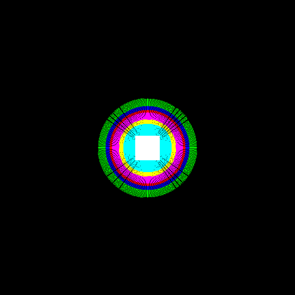

# Gravity Visualizer

Wednesday, July 15, 2015

---

Hello world, today I will be sharing a little project I have been working on involving physics, C++ and a crazy question.

A few months ago, I was talking to a friend about the destruction of Earth through a huge meteor impact and I had a crazy idea. What if a meteor shot through Earth and split the earth perfectly in half so you had two hemispheres, had the two parts moved away due to the energy of the impact and then had the two parts attract each other and collide; what would be the energy and destruction level of something like that? Now I know it sounds crazy, but it's a purely theoretical question that could possibly be simulated.

In order to begin to answer my question, I had to know how non-spherical objects attract each other and I figured a square would be a pretty easy shape to experiment with. I am working with 2D shapes because I don't know how to program 3D graphics and the math for it would get pretty messy.

Initially I just wanted to get a shape, have a small particle circle around it and collect information regarding the force exerted by the shape; all simulated of course.

The first version was coded in Python using the PyGame graphics library since I was already familiar with it and Python is cross-compatible with the Linux computers I use at home and the Windows computers I used in the classes that I developed the first version in.

Below is an image of the square I used in the first version. The square is 50x50 pixels, each being 1 mass unit for a total of 2500 mass units. Forces ≥20 are a light blue, forces between 10 and 20 are yellow, forces between 4 and 10 are a hot pink(?), forces between 3 and 4 are red, forces between 2 and 3 are blue and forces between 1 and 2 are green.



This helped solve part of the question, shapes have gravity fields that are roughly the same shape at very close distances, but as you get farther, the shape of the gravity field becomes spherical. Other shapes were tested and the same was true, but the distance at which it became more spherical was dependant on how odd the shape was. Below is a hemisphere, it has a mostly spherical gravity field, but it is just a bit lopsided.


This was all well and good for a while, but the output looked horrible and took forever to render in Python. So, about two days ago, I wrote it in C++ and made a few changes. I made it so instead of scanning in a circular pattern, it would just calculate the force present in every pixel of the 600x600 space. It would also represent the colors as a modulus function of 256 to retain a grayscale color between 0 and 255, as dictated by most RGB colors; this means that once the color surpasses 255, it starts again at 0, represented as the alternating rings. The result of the new output is shown below.


Below are more shapes which have had their gravity fields calculated, notice how the fields become more or less spherical as they go farther.


For the more code-savy people out there, I will post the general algorithm for the C++ gravity visualizer:

```
make an empty array for the coordinates and mass of the points
add points to the array corresponding to the shape you want
calculate the center of mass and move the shape so center is at origin
draw your shape on the screen
for every x pixel{
    for every y pixel{
        set force2 to 0
        for every point{
            calculate distance of pixel and point
            set force = (gconst * point mass) / distance
            set force2 = force2 + force
        }
        set pixel intensity to force2 % 256
    }
    update screen
}
draw your shape on the screen
save screenshot
```

The source code can be found [here](https://github.com/koppanyh/GravCalc).

<sub>Posted by [koppanyh](https://github.com/koppanyh) on 2015/07/15 at 3:42 PM PDT</sub>

<sub>[Permalink](https://blog.kh-labs.org/2015/07/gravity-visualizer)</sub>
