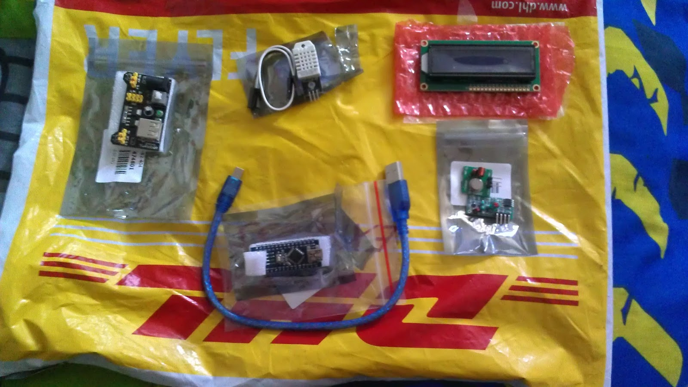

# Present from China!

Monday, August 3, 2015

---

Hello world, today a package from The People's Republic of China came in the mail for me.

A few weeks ago, a representative from [GearBest.com](http://www.gearbest.com/) reached out to me regarding a generous offer. I was told that I could receive free items in exchange for documenting a project and giving a review. I accepted, chose my products and waited for the package to arrive. It finally came, I was pretty happy.

Inside was an [Arduino Nano clone](http://www.gearbest.com/development-boards/pp_136560.html), a [DHT22 temperature/humidity sensor](http://www.gearbest.com/development-boards/pp_70485.html), a [16x2 LCD module](http://www.gearbest.com/development-boards/pp_22495.html), a [433 MHz transmitter and receiver](http://www.gearbest.com/development-boards/pp_48128.html), and an [MB102 breadboard power supply](http://www.gearbest.com/development-boards/pp_176805.html). In total, it cost $21.08, an extremely generous amount for such a simple task.

I'm planning on making a clock type thing that also displays temperature and humidity. Afterwards I might make an autonomous robot with the Clocky robot!

These things will be documented on [Instructables.com](http://www.instructables.com/)

Posted by [koppanyh](https://github.com/koppanyh) on 2015/08/03 at 8:28 PM PDT

[Permalink](https://blog.kh-labs.org/2015/08/present-from-china)
