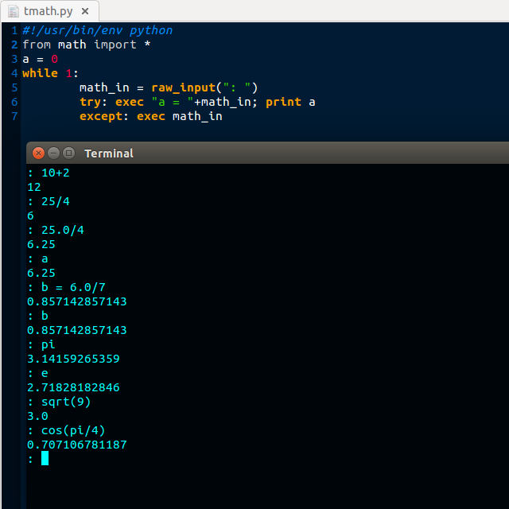

# Simple Python Command Line Calculator

Thursday, August 20, 2015

---

Hello world, today I have something that is actually useful :p

So I commonly do a lot of small math, but I also prefer to use the command line to do everything... not sure why though. I later found out that there was a similar utility called bc, but it doesn't seem as functional as I would need it to be.

Anyway, I wrote a tiny Python script that is capable of doing everything I need it to... and more. Essentially it's a Python command line interface that is geared towards math. You type in a mathematical function, and it spits out the answer. It also saves the answer to a variable called "a" for answer. You can use that variable in your math normally in case you need the previous answer for your next calculation. You can also define your own variables just like "b = 5+3" or something, and still use them for calculations.

One of the biggest features, is the ability to use the Python interface instead of just doing math. Say you want to exit, all you have to do is type in "exit()" just as you would to exit a normal Python shell. Anything that works in a normal Python shell should work in this one also. But it's geared more for speed of calculations than running Python functions.

**Note** It is recommended you have experience with Python to use this as the math functions might not be so intuitive for someone who's never used Python before. Everything is calculated as an integer unless it becomes a float (by adding ".0" at the end of a number); 25/4 comes out as 6, but 25.0/4 comes out as 6.25. You can use the traditional math functions like cos() and sin() and sqrt() and all those functions that are found in the Python math library.

I didn't attach code because those 7 lines in the picture below are all that's needed and it shouldn't take more than a minute to copy it. The terminal shows how things look/work.

Posted by [koppanyh](https://github.com/koppanyh) on 2015/08/20 at 7:30 PM PDT