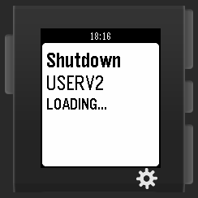

# Pebble Time Watch - Shutting Down a Server

Wednesday, October 21, 2015

---

**Here's my story:** I have this server computer that I turn on every morning. It runs some basic server stuff, syncs my FitBit to the internet and charges my phone. I turn it off before I leave to school or work in the morning because it cannot be accessed from outside my LAN network and would otherwise waste energy with no one there to use it.

**Here's my problem:** To turn it off, I normally have to SSH into the server and run the command "sudo poweroff". This normally takes longer than I would like, especially if I happen to be running late.

**Here's my solution:** Make an app for my Pebble Time smart watch that could turn my server off easily.

**My Implementation:** I decided the best way to do this was to take advantage of the PHP part of the web server, running Apache 2 on an Ubuntu Server 14.04 box. I could make a web page that runs the Linux shutdown command and replies something through HTML. Then I could make an app for the Pebble Time smart watch that calls the page and displays the status.
The PHP code looks like this:
```php
Poweroff ---
<?php
  echo(exec("sudo poweroff"));
?>
```
It is just a small PHP script called poweroff.php that runs the poweroff command and returns "Poweroff ---" plus whatever might be appended from the poweroff command. Running it is as simple as just calling "http://IPofServer/poweroff.php". \
It's important that the Apache 2 web server is given admin permissions, otherwise it cannot run the "sudo poweroff" command. To give it admin permissions, run this command in terminal: `sudo visudo` and write this line to the end of the file: `www-data ALL=NOPASSWD: ALL` then press Ctrl+x, press y, press enter and you should be good. Type `sudo service apache2 restart` to restart the Apache 2 server and apply the changes, or just reboot the whole server. \
The watch app itself was written using the Pebble.js method, this way I didn't have to waste a lot of time making it in C, but I might port it later. The code is very simple:
```js
var UI = require("ui");
var ajax = require("ajax");

var card = new UI.Card({ //init the card
  title: "Shutdown",
  subtitle: "USERV2",
  body: "LOADING..."
});
 
card.show(); //show the card
 
ajax( //send the shutdown request
  {url: "http://IPofServer/poweroff.php"},
  function(data){ //success function
    card.body("STATUS: "+data);
  },
  function(error){ //error function
    card.body("ERROR - Cannot Reach Server: "+error);
  }
);
```

**How it works:** The app just initializes a card screen and all the parameters are hard coded, but I'm planning on changing that in a possible future update. The app then sends an AJAX request to my server (where it says IPofServer, change to an actual IP) and calls the shutdown page. The shutdown page return some text, in my case "Poweroff ---", and proceeds to send the shutdown command to the system. The watch receives the output of the server and replaces the "LOADING..." (on the image) with "STATUS: Poweroff ---". If it cannot reach the server or something goes wrong, then the watch says "LOADING..." for a while and then returns "ERROR - Cannot Reach Server: " with any errors appended to it. Once you see "Poweroff ---" then you know the server is shutting down and you can press the back button on your Pebble and proceed with whatever you were doing previously.

 \
<sub>Screenshot of emulator with shutdown app.</sub>

<sub>Posted by [koppanyh](https://github.com/koppanyh) on 2015/10/21 at 9:25 PM PDT</sub>

<sub>[Permalink](https://blog.kh-labs.org/2015/10/pebble-time-watch-shutting-down-server)</sub>
