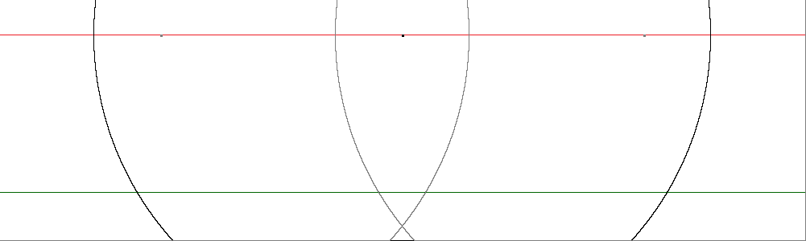
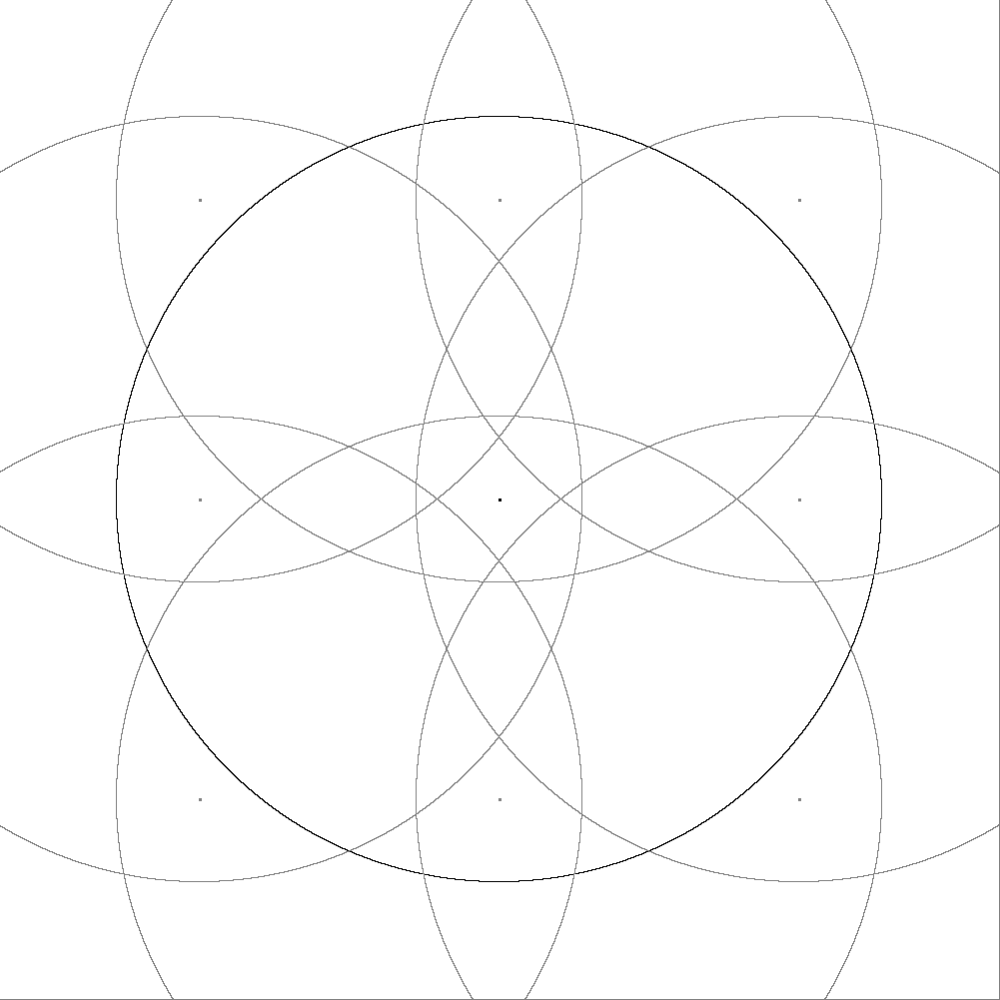

# DIY Mesh Network Protocol: The ComputerCraft Rednet Internet

Monday, May 22, 2017

***Note from the future of 2025/11/06:** This post has been sitting as a draft since 2017. Suffice it to say, this post was very unfinished, but considering that I haven't played Minecraft in years I have decided to publish it in its unfinished state during my move from Blogger to GitHub for historical reasons.*

---

## CCMesh

Before you go away thinking "ComputerCraft? Isn't that a Minecraft thing?", let me reassure you that while yes it is from Minecraft, the algorithms used in this mesh network protocol can easily be used to make a mesh network in real life. Plus, wouldn't it be really cool to have some kind of large scale internet protocol in Minecraft?

## A Little Background

I used to play on this one Tekkit server where everyone had these ComputerCraft computers and were obsessed with colonizing space. I thought it would be cool to make a little internet type of thing so that we could share programs and data from a distance since the ComputerCraft mod has limitations for how far a transmission could go (about 380 meters max). \
I spent about a year dabbling with the idea of about how it would be possible to relay messages from one part of the world to another without needing to know exact paths or anything like that, just the "IP address" of the computer you want to send the data to. \
Finally I was able to come up with an adequate solution and have implemented it in Lua, (the programming language of ComputerCraft). \
I have to say, it worked better than I expected in the tests I ran.

## Basics Of The Network

* Each computer that is "spawned" in Tekkit gets a unique ID, this is just a number that gets incremented each time a computer is made. So the first computer would have an ID of 0, the second has 1, the third has 2, etc.
* The mesh network will be communicating over wireless modems because it is much easier to install wireless beacons than to wire everything up with the wired modems (especially if you have to cover thousands of meters of area through oceans, rain forests, etc). This can be done with wireless turtles that are programmed to move up and become nodes.
* The receiving computer should be able to know the return address for the computer that sent the message.
* The mesh network will be laid out in a grid to make the algorithm easier and to provide maximum coverage.
* Nodes support pinging to find out which nodes can be used wherever you are.
* Nodes should support being able to be updated remotely to make patching and improvements happen easily and painlessly.

## The Algorithm

First let's talk about the IP format, this way we can refer to its individual parts in the algorithm. \
IP format: (next node x).(next node y).(target node x).(target node y).(target id).(sender x).(sender y).(sender id) e.g. 43.0.0.103.24.12.-5.67 \
The "next node x" and "next node y" fields specify the next network coordinates to relay the message to. To the client, this will be the coordinate of the node that it uses to connect to the mesh. To nodes, it will be the next node in the direction of the target node. \
The "target node x" and "target node y" and "target id" fields specify the

## Network Coverage

Since we don't want dropped calls with the network, I added some diagrams to show just how extensive the coverage can be. The diagrams have a scale where one pixel is equivalent to one Minecraft block.

As you can see, the coverage is not half bad. The side view coverage shows that there is coverage even in the deepest parts, but there are even areas that have more than 2 mesh nodes to access.

 \
Side View of Coverage

From the top you can see how much the nodes overlap each other at the height of farthest transmission. Of course, the distances get smaller as you get closer to the ground. You can also see how the nodes are arranged in a way to make sure that each node only has access to the nodes that are North, South, East, and West, but not diagonally (this allowed the spacing to be farther and the algorithm to be simpler).

 \
Top View of Coverage

Posted by [koppanyh](https://github.com/koppanyh) on 2017/05/22 at 5:49 PM PDT