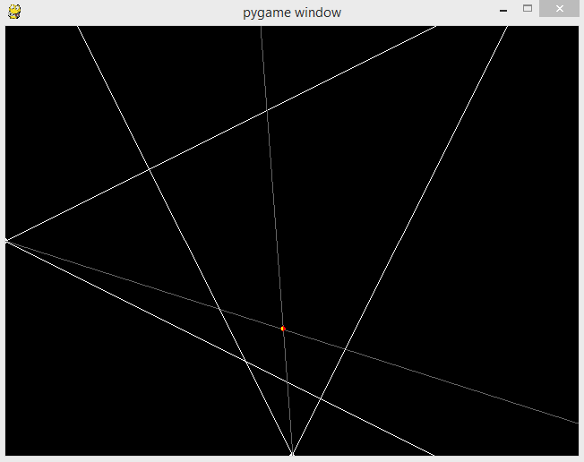
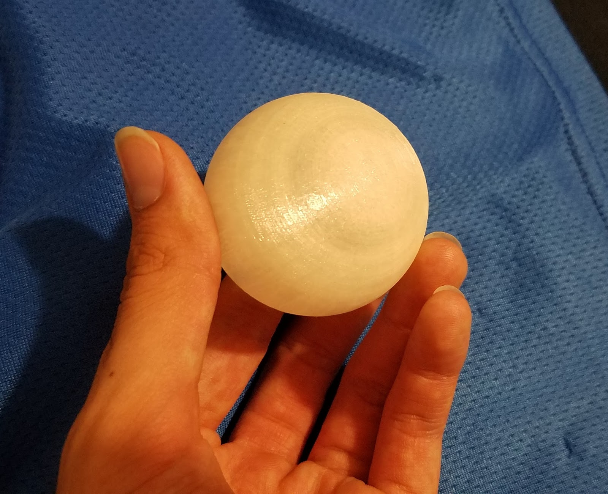
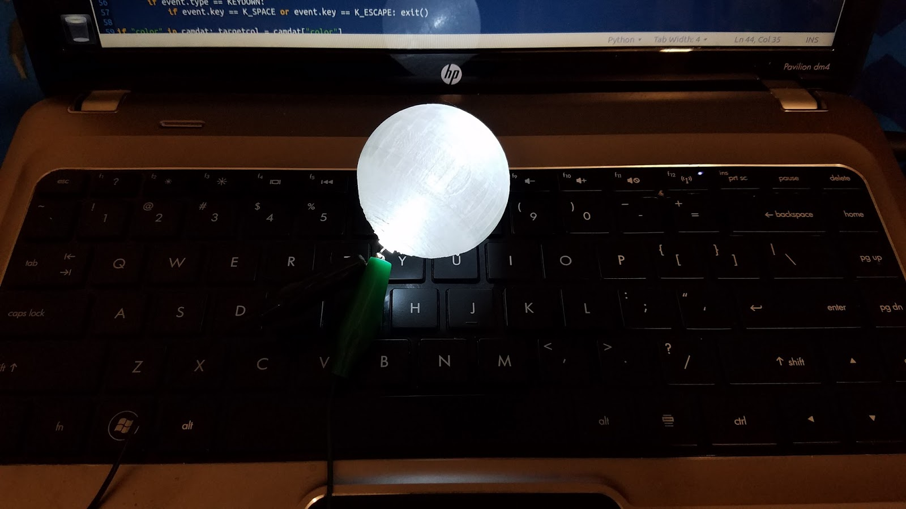
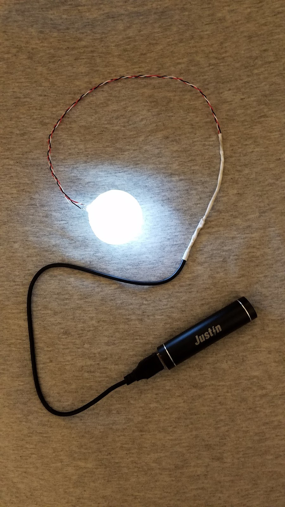
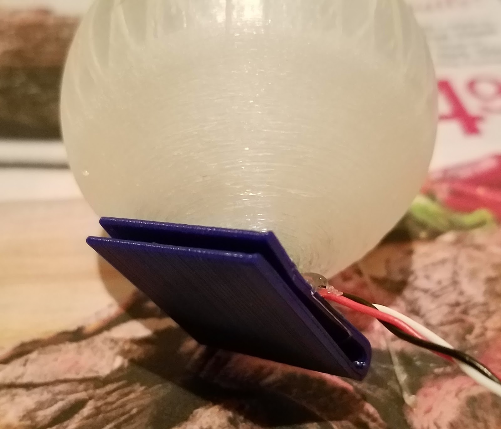
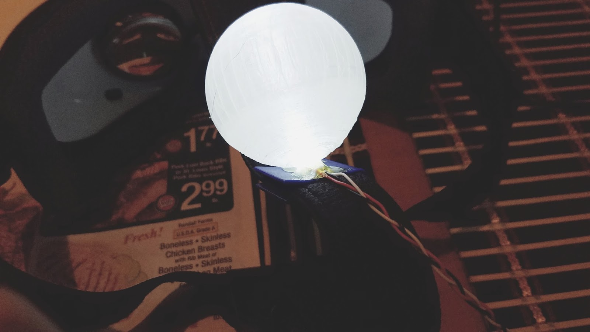
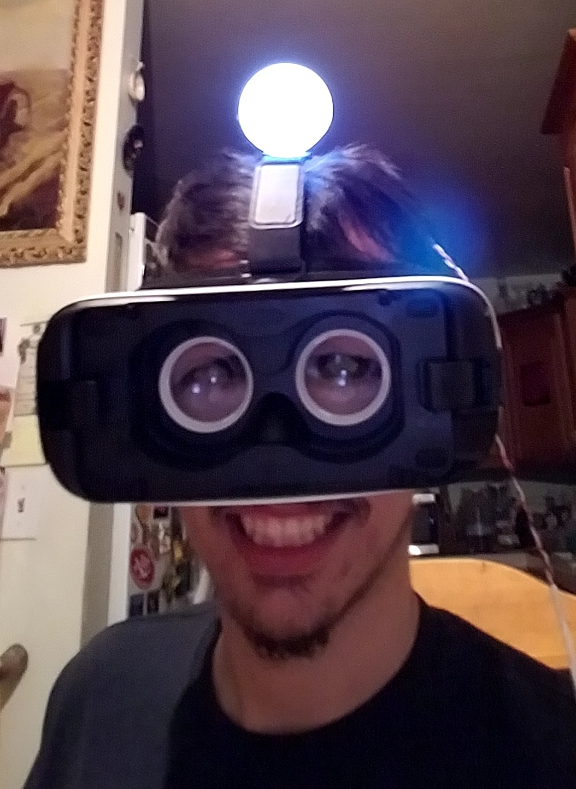
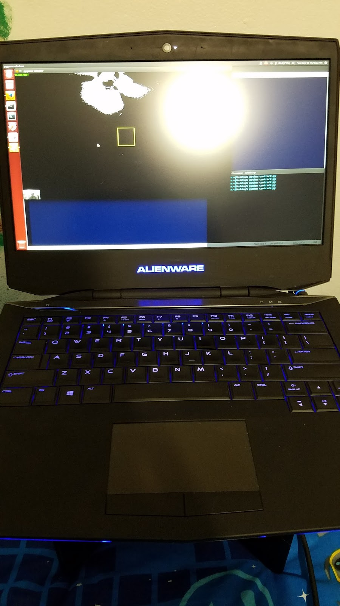
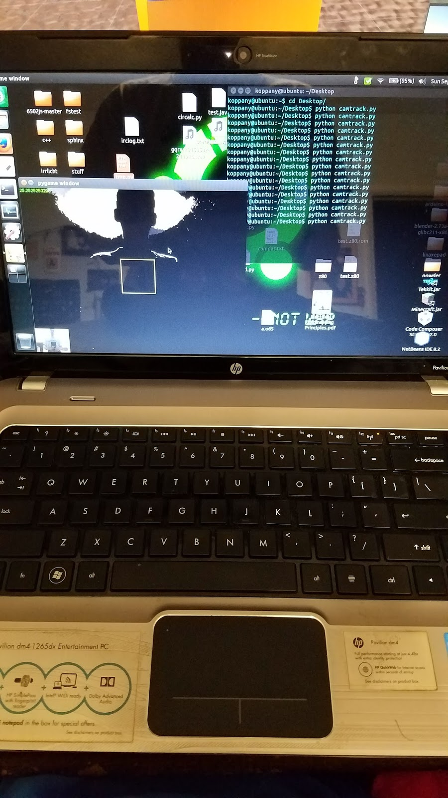
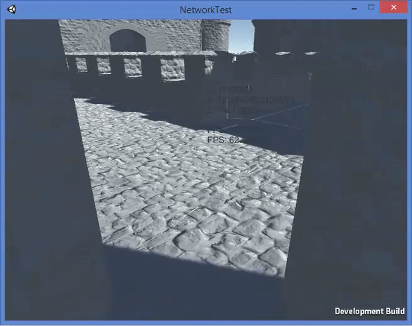

# Cheap n' Easy Optical Virtual Reality Position Tracking

Monday, September 11, 2017

---

Hello World! At this point I can confidently say that I've entered the Matrix.

(WARNING!!! This is probably going to be the longest blog post ever, you were warned.)

Intro
Over the course of 8 days (spanning from 2017-09-03 to 2017-09-10) I worked on a project that only existed in pure theory. The theory was that I could calculate my position in 3D space using only 2 cameras, an object to be tracked, and some math.

I had been wanting to do something like this for a few months, but I figured it would be really hard and take a bit of time, but I was wrong. After talking about this concept with the top programmer at the company that I work for, I realized it wouldn't be that hard at all and the math shouldn't have to exceed anything harder than basic trigonometry.

I set about to do it with materials that I had on hand, and a week later, I had a prototype of a working optical position tracking system for use in VR.

## The Theory

I figured that I could get the position of something in 3D by defining it as the intersection of 2 lines in 3D space. \
Those lines could be calculated by an image as perceived by 2 cameras, then the data of the lines could be sent to a server (or in my case the Galaxy Gear VR headset) and the intersection could be calculated there to find the position of an object (or in this case a person) in 3 dimensions. \
This way most of the calculation would be offloaded to the processors of the devices with the cameras and the network traffic would be just a few bytes to define the lines.

Since this was just a prototype for me and I wanted to finish fast, I actually made it to only calculate the x and y position of a player but not their height. The principle is the same though, just with an additional slope to calculate the height of the player.

An example of what I mean can be seen in the little animation below.



There are 2 cameras, one at the middle of the left wall and one at the middle of the bottom wall. \
Those white lines that converge on those points are the boundaries of the fields of view for those cameras, in my simulation I set them to about 60 degrees. \
The grey lines that intersect at the moving point are the angles of the target relative to the cameras.

The little animation was actually more of a simulation that I used to develop the math and logic for the system.

The angle of the target relative to a camera was calculated by the position of the x coordinate of the target in the captured frame, subtracted by the width of the frame divided by 2, then multiplied by the angle-per-pixel ratio, then added by the angular offset of the camera to switch from relative angle to absolute angle. \
The equation would be `((x_coord - (x_width / 2)) * angle_per_pix) + angular_offset` \
The angle-per-pixel ratio is calculated by the field of view angle divided by the total width of the image frame. \
The equation would be `(h_fov / x_width)` \
All the math is done with radian angles, but when describing it I use degrees (this actually caused me some problems when I forgot to convert degrees to radians >.< ). \
I also use centimeters for the position values.

Once you have the angle, the equation for the line can be written in vector format following: \
`(camera_x_position, camera_y_position) + t <cosine(target_angle), sine(target_angle)>`

Since this will be done by a computer, we can optimize by transmitting the camera_x_position and camera_y_position only once at the beginning (because the camera won't move) and then just transmit the vector part to calculate the x and y slopes as they are generated each frame.

At the beginning, you will also want to calculate 2 variables which will stay the same but depend on the positions of the cameras (this way you don't recalculate these over and over, they will only change once in the beginning).
```
c1bc2b = c1b - c2b
c1dc2d = c1d - c2d
```
Where c1b and c2b are the x coordinates of the first and second cameras, and c1d and c2d are the y coordinates of the first and second cameras.

Finally, to calculate the point of intersection, simply throw your values into this equation:
```
t = ((c1dc2d / c2tc) - (c1bc2b / c2ta)) / ((c1ta / c2ta) - (c1tc / c2tc))
gx = c1ta * t + c1b
gy = c1tc * t + c1d
```
Where c1ta is the x slope of the first camera, c1tc is the y slope of the first camera, c2ta is the x slope of the second camera, and c2tc is the y slope of the second camera. \
The gx and gy variables will be the x and y coordinates of the intersection of the 2 lines.

That's really all there is to the math. \
The value can then be thrown into a VR world to update the player's position. \
As mentioned earlier, this will only generate the 2D position of a player and not their height, but it's easy enough to add the z position.

## The Journey

Before I went through and figured out all the math, I started to make the hardware for the system. \
Then I did everything else. Here is the story.

### Sunday, September 3

I officially began development of the optical tracking system today. \
I played around with a little Python script I had in the archives that tracked things with the webcam, but I found that it sometimes had a little trouble distinguishing the object from the background if the color wasn't different enough. \
I noticed that if I shined a light through clear plastic objects the webcam registers them as almost pure RGB white, while the rest of the background wouldn't come close unless it was illuminated. \
This made me think that I could use an illuminated tracker to keep the position, this way I wouldn't need a specially colored room but instead just a slightly dark (read "badly illuminated") one to separate the illuminated tracker from the darker setting. \
Since I would be doing this with things I had on hand, I decided to 3D print a ball because I didn't have ping pong balls on me; I also thought that ping pong balls were a little small and a slightly larger ball would make things easier for the tracking program. \
I quickly designed a hollow ball with a wall thickness of around 2(?) millimeters and a diameter of 50(?) millimeters and printed it out with "transparent" PLA filament. \
It took about 5 hours to print (I really have to play with the settings on my printer one of these days) and came out pretty good considering there were no supports in the print.



### Monday, September 4

I came home from work and went to find an LED for the ball. \
I scrounged around in the LED section of my parts box and found an LED that came from an LED throwie I found once. \
This is the part where I regretted not printing the ball with a hole for the LED because now I had to go drill one out. \
A few minutes later I managed to make a very nicely sized hole using a drill bit that was just way too small. \
I jammed the LED into the ball, hooked it up to a small variable power supply and started upping the voltage just a bit. \
I figured that the LED took a standard 3.3 volts at 25 mA max. \
I played around with voltages because I couldn't have something too bright or else it would cause lens flares which mess with the tracking program (lens flares on crappy webcams?).



### Tuesday, September 5

I came home from work and started to design the power supply for the ball. \
I didn't want to use normal batteries because they're bad for the environment and so annoying to replace all the time, so I decided to use a little 5 volt power bank that I had laying around. \
Since I'd be working with 5 volts, I'd definitely need some resistors to bring the current down to manageable levels. \
Ideally, to get the 25 mA from a 5 volt power supply, I'd need a 68 ohm resistor, but I didn't have anything that small and wasn't going to buy resistors. \
I settled for 3 330 ohm resistors in parallel, which would give me 110 ohms, which would give me about 20 mA. \
That 20 mA is still a little brighter than I would have liked, but it didn't seem to be causing any lens flare so I figured it would be fine. \
I also diffused the LED with some sand paper because the light distribution inside the ball was too uneven. \
After the sand paper treatment the ball was glowing much more evenly.

### Thursday, September 7

I didn't do much today for the tracking project. \
I started working on the program that you see in the animation so I could develop the math and logic required for turning 2 lines into a positional coordinate. \
I didn't get too far on this, I was pretty tired.

### Friday, September 8

It's been a few days since I've really worked on the system, but today was very productive. \
I was at university all day today, but I used my time wisely and got a lot done at school. \
I designed a clip that I would use to hold the ball to the top strap of my VR headset; I had 20 minutes to design it before class, but setting up my environment on a school computer took about 5 minutes, so I had 15 minutes to design a clip and get to class. \
I designed the clip from memory and without any real measurements of the strap that it had to go on. \
Then I exported it and realized that class was starting 30 seconds ago, needless to say I was a few minutes late, but we were only taking a test and I was still one of the first to finish so it was ok. \
After class, I went to the university's maker space to use their (free) 3D printers to print out my clip, this way I wouldn't waste precious time at home printing it out. \
About 40 minutes later I had a beautiful clip all printed out and I tested it on a flap on my backpack, it worked pretty good and didn't break from being flexed a little. \
I had a bit of time during a period between classes, so I used this time to finish developing the math for finding the intersection of 2 lines that are in vector format. \
I had to relearn how to work with vectors and I was finally able to come up with an equation to return the intersecting coordinates of 2 lines. \
Then I worked on optimizing the equation as much as possible, but it was such a simple equation that there wasn't much to optimize. \
I went home a few hours later and got to work on "professionalizing" the power cable for the LED. \
I got an old USB cable with a bad data line and cut it so that I could have a nifty USB plug. \
Then I went to the "workshop" (the top of the washing machine) and started to solder it all together. \
I braided the wire from the resistors to the LED myself, this was to keep the 2 wires from making a mess, instead they stay as one bundle and there's even an extra wire to make it stronger. \
I even added some heat-shrink tubing over the junction between the resistors, USB cable and the wires carrying power to the LED. \
I did have a little trouble getting the tubing over the resistors because the resistors barely fit, but I managed to get the resistors into the tubing eventually. \
I plugged the LED into the power supply and then pushed the LED into the ball to see if my soldering was good and to see if there were no short-circuits (not recommended to test this way on a Li-ion battery by the way), and it worked.



I then began the hot-glue part of the project. \
I glued the LED into the ball, then I glued the 3D printed clip to the bottom of the ball next to the LED. \
Then I glued the wires to the clip just to prevent the solder joints on the LED from becoming too stressed and breaking off. \
A closeup of the finished product is shown below.



The ball clipped to the top strap of the VR headset is pictured below. \
Everything fit perfectly and I was quite pleased with the result.



Here is an extremely rare picture of (some of) my face and what I look like wearing the VR headset with the tracking ball attached to it. \
It only looks like I'm wearing a weird set of goggles because this headset works by clipping my phone into it, but I had to use my phone to take the picture, so you can see my eyes through the lenses designed to keep my eyes from melting from the proximity of my phone screen.



### Saturday, September 9

I wasted a lot of time today trying to do homework for my computer engineering class, but I didn't get too far since the homework covered a lot of concepts that we haven't even heard of yet. \
I spent the rest of the day building the virtual reality world that I would try as my test platform. \
It wasn't anything too spectacular, I actually spent more time trying to get a UDP server coded in C# for .Net 2.0 which was interesting because the only exposure I have to C# is other small programs I've written for past VR experiences. \
The fact that the code that I was going to use for a simple UDP server was geared for .Net 4.0 didn't help, it took me a while to get it to work for .Net 2.0 but I eventually got it to work. \
I made a simple test where I set the coordinates of a cube over the network. \
I also added some blocks to play with and push around. \
Then I added a little kiosk computer thing which reported the FPS for me, this way I could keep an eye on the FPS and reduce the effects of simulator sickness (which by this point became very common for me). \
Once I had that much done, I figured I could get the rest of it done tomorrow.

### Sunday, September 10

This would be the big day for my project, I was determined to get it all finished today because I knew that if I waited any longer, then I'd never get around to finishing it. \
I spent the second half of the day finishing the VR world and then writing the full version of the UDP server that would receive the data for the lines and calculate the position from that. \
Since I already had code written to find the intersection, it just had to port it to C#, which wasn't a big deal. \
The bigger deal was fixing all the little nuances that would cause the VR experience to crash from errors that happened in the UDP server code and from other small things. \
Then I added a castle that I found here so that I could have something fun to play with. \
Then I worked on finalizing the tracking code. \
There wasn't too much to do here, just get the coordinates, run it through some math to turn that into an angle and then to a vector line, and add some code to transmit it all to the VR headset. \
I designed the tracking code to have a configuration file so that I would only have to configure and calibrate things like FOV and target color and camera position once. \
I did have a little problem where the coordinates were being calculated in reverse, so moving left brought me right and visa versa. \
The solution was simple enough, just mirror (or in my case un-mirror) the image that the webcam was returning and the motions were coming in just right. \
I compiled the VR experience just one more time and uploaded it to my phone for later usage. \
Then I set up 2 laptops with webcams and the tracking script. \
I measured their positions, calculated their FOV's, set their unique identifiers, added their threshold for the tracking color and set their offset angle. \
Then I got them ready to start tracking and transmitting, the server (headset) needs to be started first before the client tracking programs so I set it up to just have to hit enter on each laptop once I'm in VR. \
I put my phone into the headset and turned on the tracking ball, then I put on the headset. \
Once the VR experience started, I pressed enter on both of the laptops, then I officially entered the Matrix. \
The below pictures show the laptops running the tracking program.




I navigated myself to the top of one of the towers on the castle (using the touchpad controller on the headset) and then started looking around. \
Below is a rendering of what I experienced moving forward to look past a corner in the castle that I had in the world. \
It was one of the most exciting things that had happened to me in a while.



The delay between when I moved in real life and when I moved in VR was noticeable. \
The delay was less than a second, but still about 200 or 300 ms. \
Nevertheless, I was moving around in a world I built, able to look around and not have the whole world move with me. \
It was magical. \
But it did mess up my depth perception and my perspective a bit. \
I had somehow adjusted to those few minutes of VR so fast that coming back to real life was like entering VR, the perspective was weird and my motions weren't delayed.

## The Future

As much of a success as this was, there are still a few things I'd like to change.

For one, I'd like to add the 3rd dimension to code for height because while moving around didn't make the whole world move with me, moving up and down did. \
Plus, adding the 3rd dimension wouldn't be too hard, it would just take a little more time.

Another thing to fix is the issue where looking up makes my head obscure the tracking ball from one of the cameras. \
Usually the tracking program finds the ball once I make my head level again, but it still happened a few times where it didn't reestablish tracking. \
The easiest solution is to raise the height of the cameras, but I think that cameras with a wider FOV would also be good.

The other thing I'd like to fix is the latency issue. \
I think the biggest issue is with getting frames from the camera. \
I ran a test without the line that gets the image from the camera and the tracking program ran at over 100 FPS, but with the camera line the program only ran at around 12 FPS. \
It's also possible that the network code adds a tiny noticeable amount of delay, but this is just a guess, I would think that it shouldn't be too bad over a LAN network, but then again, I'm no network admin.

Another thing I'd like to do is to write an Android app for the tracking part so that I would have a smaller and more portable way to deploy the cameras. \
This would allow more people to try it out just by installing the app and changing some settings. \
When (more like if) I do this, I'll probably use OpenCV since PyGame isn't available for Android. \
It probably wouldn't be a bad idea to use OpenCV on Python too, it's probably more suited to camera tracking than PyGame.

## Code and Resources
Everything you need to replicate this project can be found on GitHub. \
https://github.com/koppanyh/VR-optical-tracking \
But I give no guarantee that my documentation is good enough for you to figure it out from my code alone.

<sub>Posted by [koppanyh](https://github.com/koppanyh) on 2017/09/11 at 10:50 PM PDT</sub>

<sub>[Permalink](https://blog.kh-labs.org/2017/09/cheap-n-easy-optical-virtual-reality)</sub>
