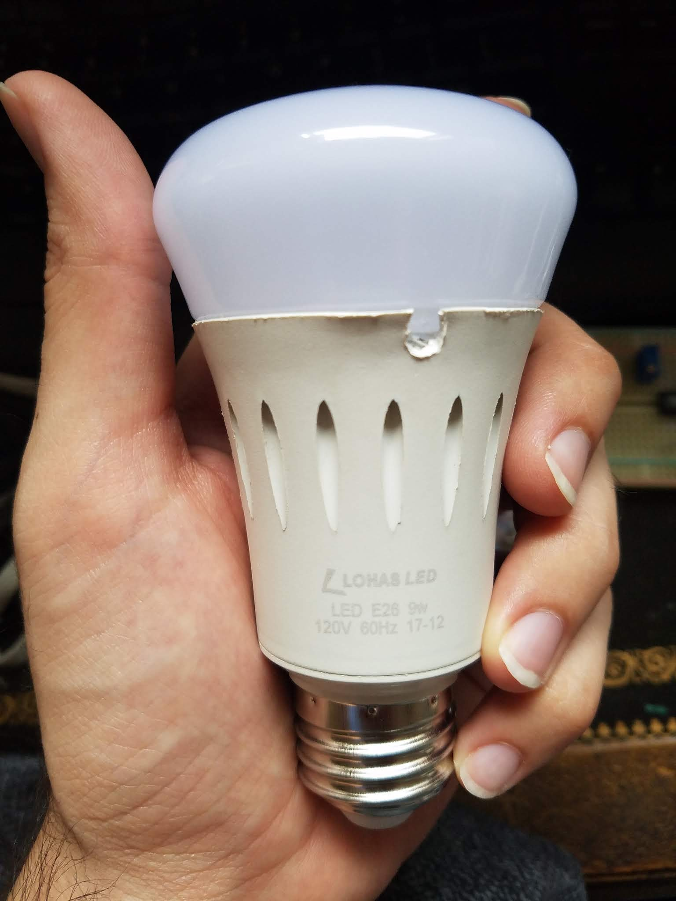
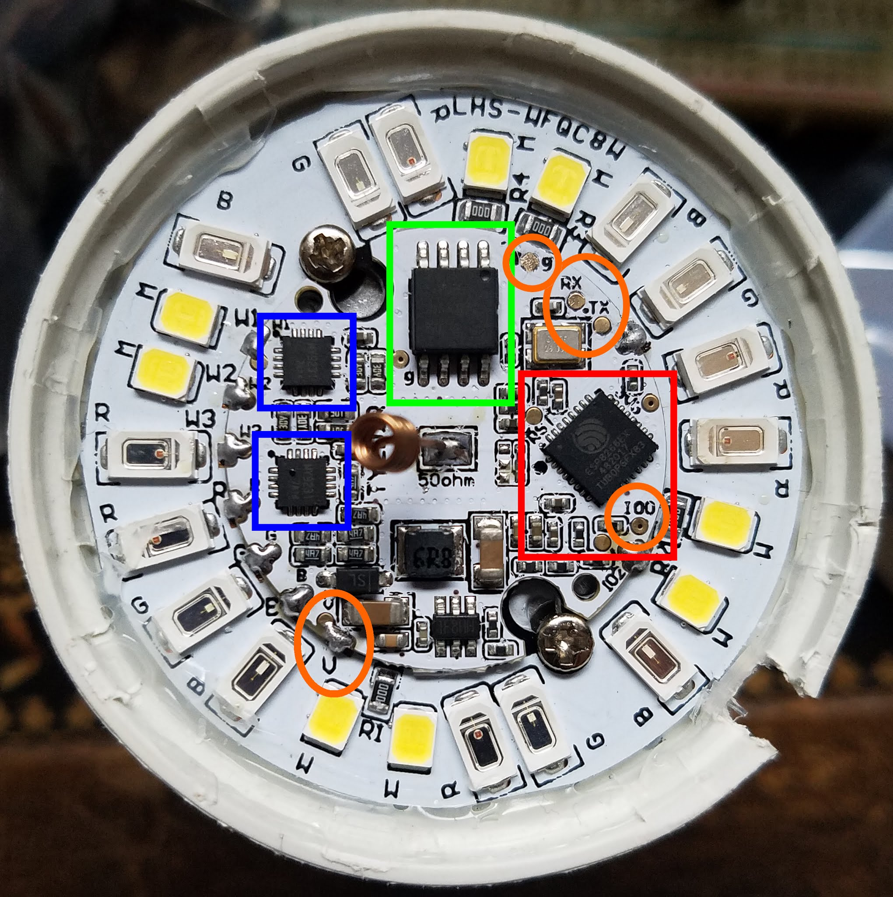
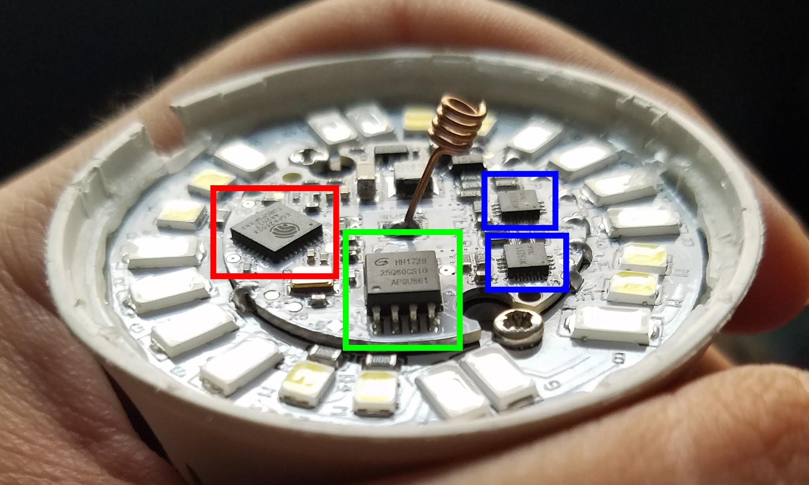
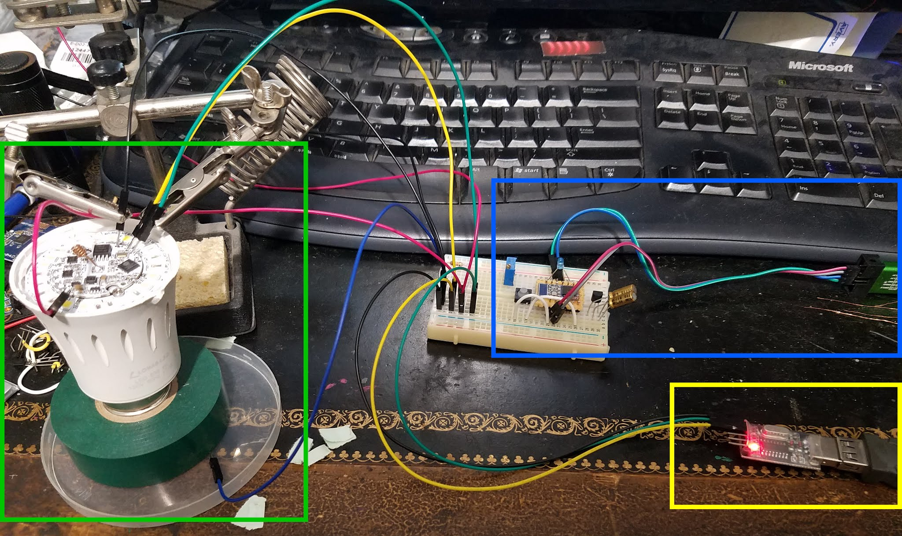
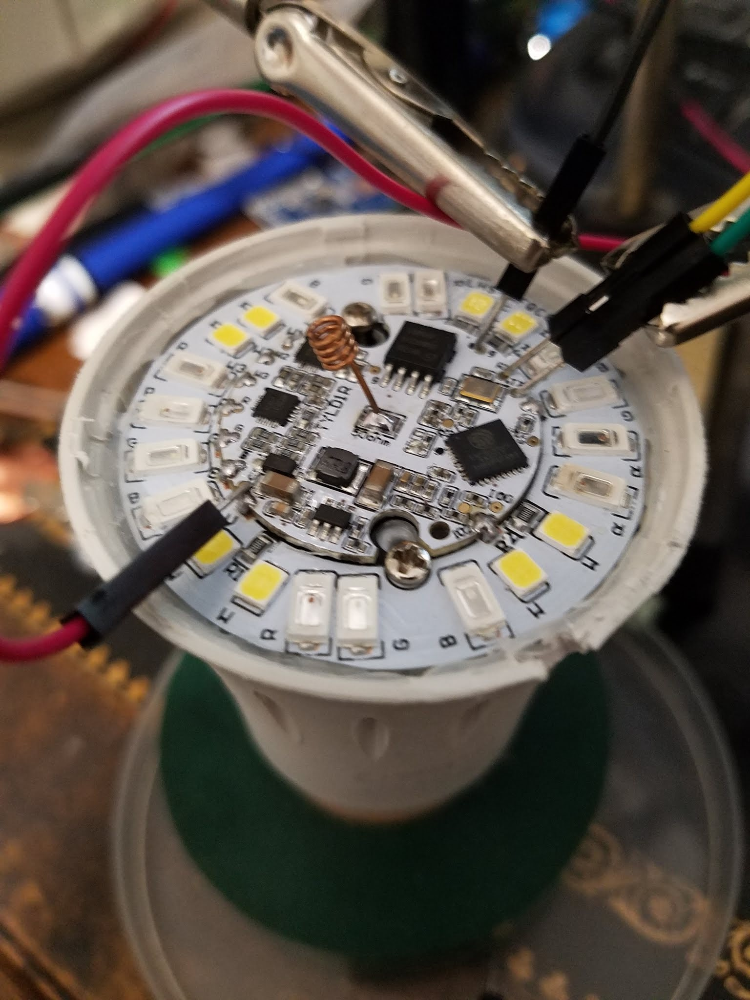

# Espurna on the Lohas LED 9 Watt E27 Smart Bulb

Tuesday, August 14, 2018

***Note from the future of 2025/11/06:** This post has been sitting as a draft since 2018. Suffice it to say, this post was very unfinished, but I no longer remember the details after so many years and have decided to publish it in its unfinished state during my move from Blogger to GitHub for historical reasons. P.S. I still use this lightbulb and it's still working with the original firmware hack that this post was based on.*

---

Hello world, I know it's been a while, but this post might actually be useful for some people.

I wanted a smart light bulb, but I wanted something that I could program myself (a minor requirement for many of my electronics) and make it so that it wouldn't require an internet connection (LAN network is preferred).

I've seen articles that talked about flashing [ESPurna](https://github.com/xoseperez/espurna) onto a cheap ESP8266 based smart bulbs, so I figured I would need a bulb with an ESP8266 in it.

After a bit of searching, I found this bulb (with appropriate SEO title): \
[LOHAS Smart LED Bulb, Wi-Fi Light, Multicolored LED Bulbs(UL Listed), A19 LED Dimmable 60W Equivalent(9W), Smartphone Controlled Daylight & Night Light, Home Lighting Compatible with Alexa(1 Pack)](https://www.amazon.com/gp/product/B01MYQCXOH/ref=oh_aui_detailpage_o00_s00?ie=UTF8&psc=1) \
I've heard that most cheap smart bulbs aren't bright enough, so I picked this one because it was rated for slightly higher wattage, which I hoped would mean slightly brighter light. \
I also hoped that this one would have an ESP8266 in it (which it did) because that wasn't rated anywhere. But I heard that if the bulb uses the Tuya Smart app then it is extremely likely that it uses some generic firmware on an ESP8266.

Once I'd ordered the bulb, I looked into other people's experience with flashing this bulb only to find [one GitHub post](https://github.com/arendst/Sonoff-Tasmota/issues/1821) that was not about using ESPurna and that they were having a little trouble flashing their bulb. This bulb was also not listed as supported by ESPurna. Not too good, but no big deal since I was prepared to modify some firmware if necessary.

safety waivers

teardown

struggles and solutions

espurna build options

basic http api

Posted by [koppanyh](https://github.com/koppanyh) on 2018/08/14 at 5:24 PM PDT

[Permalink](https://blog.kh-labs.org/2018/08/espurna-on-the-lohas-led)
