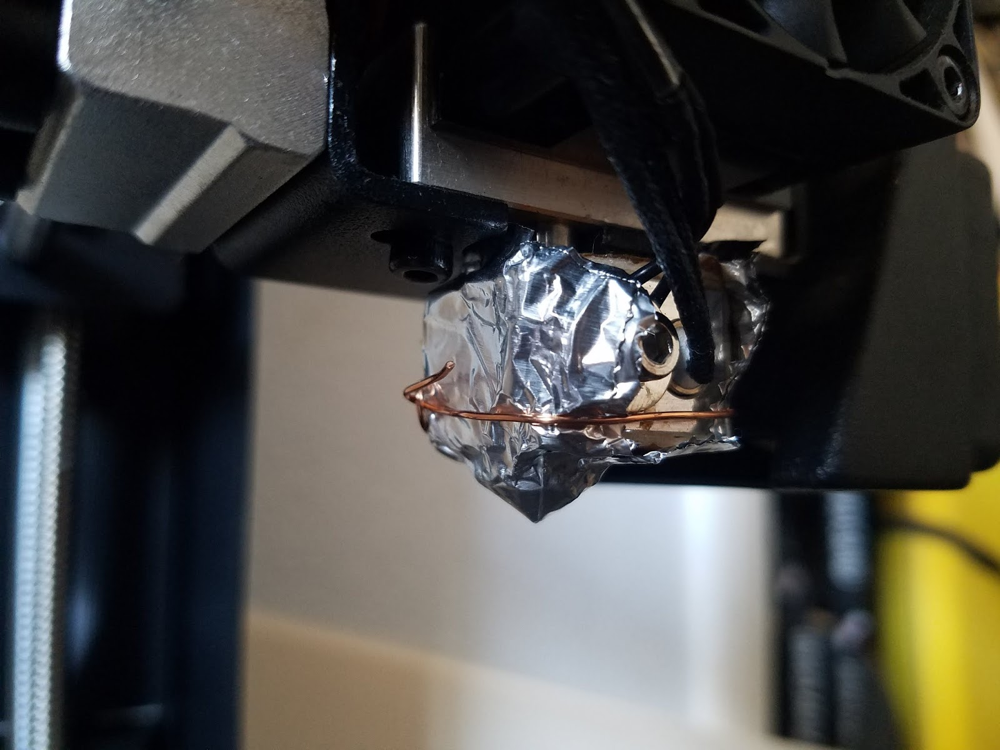
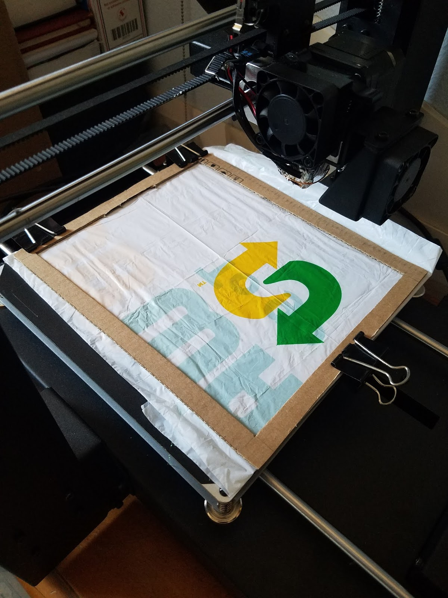
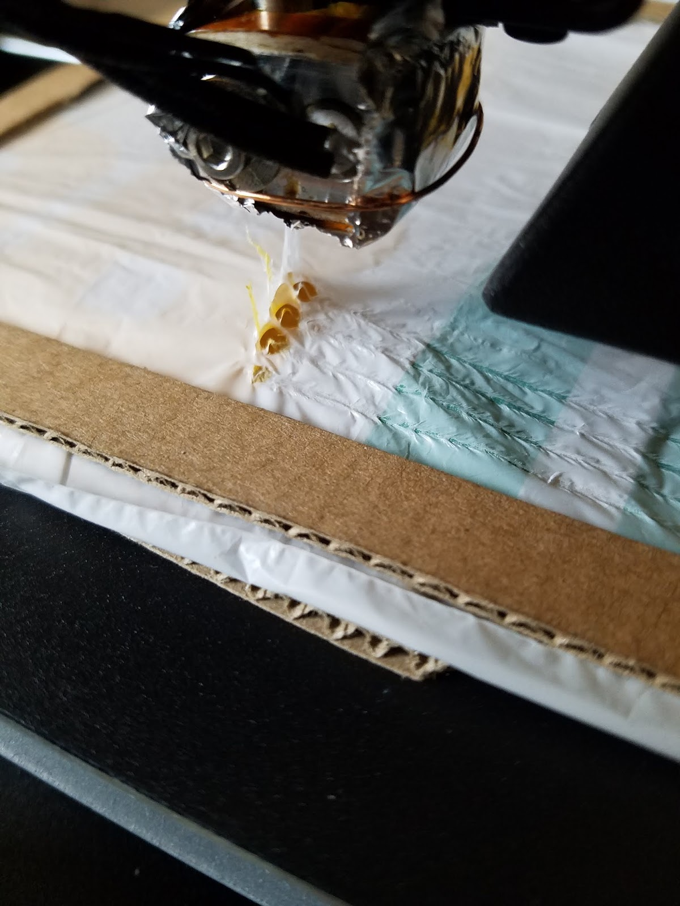
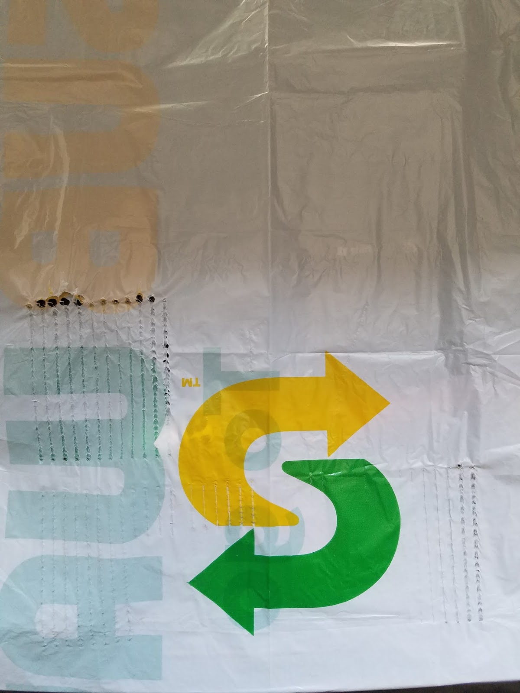
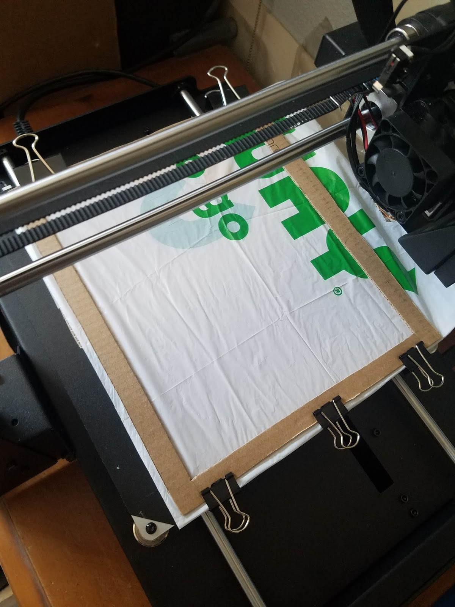
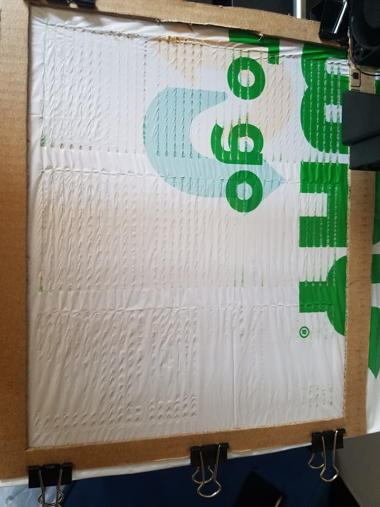
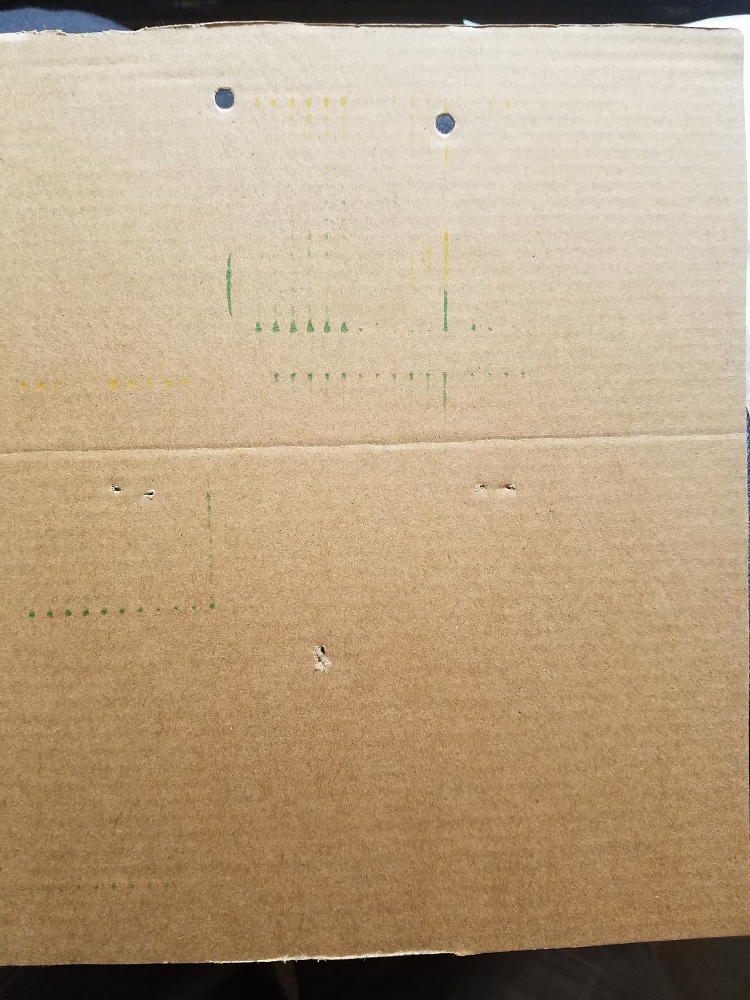
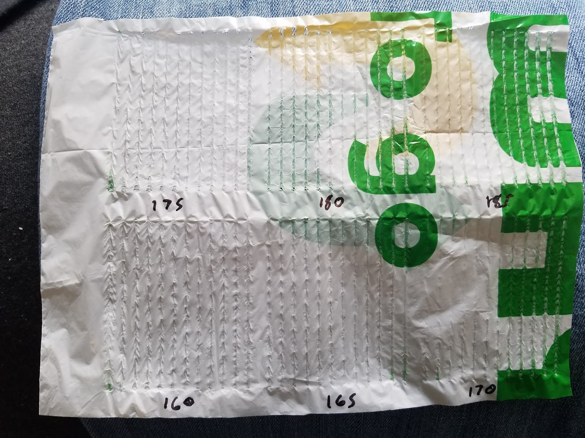

# Using a 3D printer as a CNC plastic welding machine

Sunday, May 10, 2020

---

## Intro:

A friend and I were discussing fusing plastic sheets and creating complex patterns and specific curves with the seams. This reminded me of a thought I had a while back to use a 3D printer as a CNC plastic fusing machine since the position is computer controlled and the print head can be set to specific temperatures for melting the plastic. There is a technique to use a soldering iron to fuse plastic sheets by hand, and this would be the robotic equivalent.

If this works with such thin plastic and on a smallish scale, then it could be a good method of producing inflatable pneumatic actuators for soft robots (which is something I've been trying to figure out how to do cheaply and easily for a little while now).

## The Plan:

Before being able to use my 3D printer (Monoprice Maker Select Plus) as a CNC plastic fusing machine, I'd need to find out the correct temperature and speed to use on my material of choice: disposable Subway sandwich bags, the thin ones for a single sub. \
According to Google, a thin plastic shopping bag is about 0.5mil, which comes out to about 12.7 microns, which is thin, and according to my friend might be harder to work with due to how thin the plastic is (I can confirm having tried to fuse this plastic manually with an unregulated soldering iron before), so this test is absolutely necessary.

The idea I came up with for the test looked something like this in order to test a variety of speeds and temperatures:

The rows would keep on increasing in temperature as they went up, and the speed would keep on getting faster.

I decided this wouldn't be able to fit enough rows on my tiny printer, so I made it more like a grid of temperatures with 12 lines each starting at a slow speed and ending with a fast speed (although this was later reversed to start fast and end slow).

If I was going to melt unknown (probably LDPE) plastic with my print head, I didn't want to contaminate it or risk it in any way, so I added 2 layers of aluminum foil to the print head and secured it with a wire loop.

Then I cut out a cardboard holder for the plastic and clamped it onto the build plate with binder clips. It's a sandwich with a cardboard square underneath the plastic sheets, the sheets themselves, then the cardboard frame above that.

The cardboard on the bottom also works to keep the print head from scratching the build plate if something went wrong, the worst that would happen is the plastic would be ripped and the cardboard would have indentations in it.

## The Software:

I wrote the control software for this in Python 2.7 (I know, I know, Python 2.7 is dead, but until the python command stops bringing up version 2.7 in the Ubuntu terminal, then I'll probably keep on using it, and no I don't want to change the link to point to Python 3 😛). The repo is at https://github.com/koppanyh/Plastic-Fuser \
All it has to do is generate the G-code to be sent to the printer and make sure the lines are within the cardboard frame, and at the proper height and temperatures and position and everything. \
I spent an entire day writing it, which is sad because I thought this little experiment would last about half a day and be done, not take me 1.5 days to do in which more than a day was spent just on the software.

I tried to make a nice interface, so the output is color coded (error are even red and everything) and the calibration section was designed so you could only type in what you wanted and skip what was already good.

Since in my testing the calibration data didn't change often (only if you messed around with the cardboard frame) it made sense to be able to save and restore it from a file so you wouldn't have to go through the calibration multiple times.

The calibration step would ask you to input the coords for a specific corner, like "upper left", and would present you a prompt to type in X's value followed by a default value which was the last X value you typed in. If you type in a value, then it sets X at that value, if you hit enter it will use the previous value and if you type # then it moves onto the next corner. After X is typed in, it asks for Y and follows the same input convention. The Z axis stays at 10mm the whole time so it's hovering over the plastic.

Once all the corners are specified, then it calculates the center by averaging all the X coordinates for the center X and averaging all Y coordinates for the center Y. It looks like this (green point) and is better than the red point because it's the position that is more or less the farthest from all the edges at once (the red can get really close to the edges if you squish the square in just the right way).

Then the software visits all 5 points and for each one asks the Z height. The prompt for each Z is the same as for X or Y in that you can enter new, reuse previous, or move onto the next action.

The software then calculates and instructs the printer to draw lines at the positions and temperatures and speeds detailed in the grid image above.

To make matters complicated, if the build platform quad is not made of right angles, then the software will calculate the paths so they are squished in the same manner as the work surface. So if the top is bigger than the bottom (upside down trapezoid) then the lines will be angled in a way to diverge following this expansion.

To make things even more complicated, the cardboard piece at the bottom was not flat, and so was warped. I added code to attempt "bed leveling" in software to correct the Z height for this. It worked ok, but I realized a major flaw. The software calculates the Z for the starting point and the ending point, then draws a 3D line directly between the 2. This probably does not follow the surface of the cardboard when modeled as a pyramid with the 5 points. My poorly illustrated drawing attempts to show this. On the left you have the pyramid with the line going from one side to the other. In an ideal world it would climb up the starting face, then across the middle face, then down the ending face (depicted on the right by the line that goes over the pyramid cross-section). In reality it goes straight through the pyramid (the line that goes through the cross-section). Fortunately the difference in heights is around a millimeter or less, so this inaccuracy isn't a big deal since the cardboard is a bit flexible.

The software was given a PRODUCTION flag that when set to true will output over serial port to the printer, or when false will output to a debug.gcode file. This G-code file was viewed in https://ncviewer.com to make sure the paths were correct and to see if the warp compensation was working good enough. I had to fix a few little bugs dealing with the coordinate system, but for the most part it seemed to work more or less the first time. Good thing I could preview the movements before actually using the printer.

## The First Test:

With the software done it was finally time to run the first actual test. There was a pretest where I ran the software but gave the Z axis a +10 offset so it wouldn't touch the plastic and turned off thermals just so I could see the path once in software. It looked good so I was able to undo those little changes to have it run the real deal.

This test would be as planned, 9 thermal regions with 12 lines each. The temperature would start at 115°C and increase 15°C on each following region to end up with 280°C at the last region. The lines in each region would have the first one drawn at 11994mm/min and be decremented by 954mm/min until the 12th line would be drawn at 1500mm/min.

Here is a video of the first 115C region being drawn: \
https://twitter.com/koppanyh/status/1259620567235170305?s=20

## Issues:

There were some major issues with this test. At the start I could see that the plastic needed to be stretched tighter because the extruder seemed to be dragging the plastic a bit. Then I saw the hotend's blower fan nozzle hitting the binder clip at the bottom middle, I'm sure this contributed to a bit of misalignment. Then I noticed the temperatures were changing to the next temperature almost halfway through drawing each thermal zone. This was because apparently the M109 command doesn't wait for movements to be done before it tries to change the temperature, so it would be changing the temperature as soon as the buffer would have space for the command to be sent. Some of the faster lines would go really slow for some reason and then would finally run at the expected speed once the speed was at or below around 8000mm/min. And when the temperature was high enough the hotend would poke holes in the plastic because the plastic would stick to it and when it pulled away it would pull a hole in the plastic.

## The Second Test:

With those issues, I killed the test less than halfway through, made minor code modifications, made tiny hardware adjustments, and started the test from scratch with fresh plastic. This was the progress of the first test:

I solved the loose plastic, blower nozzle collision, and hole poking problems in one go by manually taking care to keep the plastic tight and using 3 mini binder clips at the bottom.

The issue of temperatures changing before it was time was solved by adding the M400 command right before the M109 commands, this way it would wait for the current movements to be done before it changed the temperature and queued up the next set of movements.

I didn't know how to solve the issue where some fast lines run way slower than expected, but I didn't run into that issue this second time around. My theory is that it was some kind of weird behavior related to changing the Z height for warp compensation (which is theoretically a buggy feature anyways) and the new calibration after moving the cardboard somehow didn't trigger this behavior.

I changed the thermal zones to start at 145°C and increase 5°C on each following zone so it would end at 185°C. But I kept the 9 zones with 12 lines and speeds the same. This is what it looked like:

## More Issues:

Of course, second time's not the charm, but this test did go much better than the first one. At thermal increments of 5°C, my printer did not have the accuracy to maintain this, so as it drew out one thermal zone I would notice the temperature wandering between ±5°C. This means that the results in one thermal zone would be similar to its neighbors' results. The Z height calibrations were too high on the lower right side, so you can see that some of those lines are only partially drawn. I forgot an M400 command at the end to delay turning off the heater, because of this the final thermal zone started at 185°C dropped to about 170°C by the end. There was still the issue of the plastic bunching up as it was dragged a bit by the hotend, this would create a skipping patter on some lines when the hotend would just run over those bunches. And at higher temperatures I noticed color bleeding from the plastic onto the cardboard, which would have stained my precious heated bed if the cardboard wasn't there to protect it.

## Results:

Once this second test was done, the results were good enough to analyze the seams.

Immediately the bottom row (145°C, 150°C, 155°C) just peeled apart with pretty much no effort. It wasn't just the partially drawn lines because they had sections that were contacted by the hotend. These temperatures were discarded.

I labeled and cut the rest of the thermal zones out to analyze them one by one (picture was before I cut them to individual sections).

I peeled each one apart, starting from the left where the lines were drawn fast and ending where the lines were drawn slow. The common observation was that the first half (the highest speeds) always came apart without a fight.

At 160°C only the slowest speed (1500mm/min) didn't practically fall apart by itself, but it was still peeled apart too easily.

At 165°C it acted like at 160°C, but the last one required just a tiny bit more force to peel apart, still too easy though.

At 170°C the last 2 (1500mm/min and 2454mm/min) hung on nicely near the end, but the higher heat and bunching issue caused it to form holes along the seam as a pulled it before the seams finally gave up. The force to do this was starting to get acceptable though.

At 175°C the fastest 8 seams broke pretty easily. The next 2 seams looked nice and didn't break without a fight. The last 2 seams had holes from the heat, they seemed pretty strong though.

At 180°C it pretty much acted like at 175°C but the last 4 seams all looked nice and were pretty strong, but there was significant bunching on these. The nicest results were on 4362mm/min, just like at 175°C.

At 185°C the first 6 seams broke apart too easily, and this was the one where a missing M400 command caused it to start cooling off before all the lines were drawn. The remaining seams were pretty strong, but there was heavy bunching on all the lines and some small holes on the slowest 2 speeds.

## Conclusion:

None of the seams produced in this experiment were particularly acceptable for pneumatic applications. Part of the reason could have been that variables such as contact surface or contact pressure were not regulated in any way, but could make big differences in how nicely the plastic was fused.

Based on my limited testing and experience trying to do this process manually, it seems that Subway bags are not a good material to use for manufacturing pneumatic bladders using thermal plastic fusing. It is possible that it could work, but it would most likely need either a more precise setup, or a different approach altogether.

It will be necessary to continue exploring ways to cheaply, quickly, and easily make soft robotic pneumatic actuators.

Regardless of the failure of this project, I learned a lot about G-code, and interfacing with a printer over serial connection. I also learned that the Subway bags I've hoarded are not as useful as I was hoping they'd be 😛.

## Future Improvements/Research:

If anyone wants to replicate or continue this experiment, here are some suggestions for ways to improve or explore different options.

Use a better surface than warped cardboard. Something that is level by default and preferably still able to take a bit of a beating if your extruder goes down too far without damaging the extruder itself.

Maybe create a surface that is suspended by springs, so the hotend can go down a bit further and the springs will provide almost constant pressure at any point of the plastic instead of it being at the whim of the warpage and warp compensation/calibration.

Pay better attention to making the plastic as tight as possible. This is harder than I thought and I probably should have spent more time on this. Don't make the same mistake as me!

Having a rounded heating tip would probably be more effective than a point covered in aluminum foil. Maybe something like a brass screw with the same thread as the extruder with one side rounded into a hemisphere. This way it can screw into the hotend and provide a much nicer contact point that might help with the bunching problem.

## Miscellaneous:

While analyzing the thermal zones, I found some dried Meatball Marinara sauce on the bag. It had been there for quite some time, but it was in a small enough amount that I didn't notice it before until I started looking closely to inspect the seams. Good thing there was cardboard and aluminum foil separating the printer from the plastic because I don't want that stuff defiling my printer 🤣. This most likely won't be a problem for normal people because normal people don't eat as many sandwiches as I do (at least I hope).

I also realized that I kind of wrote this like a detailed lab writeup essay from college, which is funny because I absolutely hated writing anything and there's no way I would have been able to write all of this in less than a day in one sitting the way I did here. It helps that the language and format are much less formal than what's expected in college, and the topic is much more interesting than the kind of stuff I had to do in college 😛.

Posted by [koppanyh](https://github.com/koppanyh) on 2020/05/10 at 11:03 PM PDT
