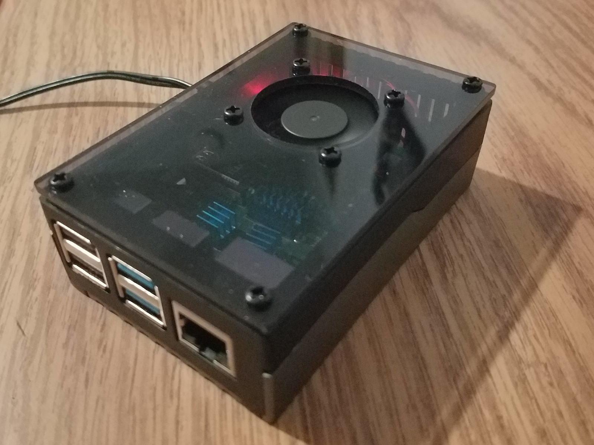
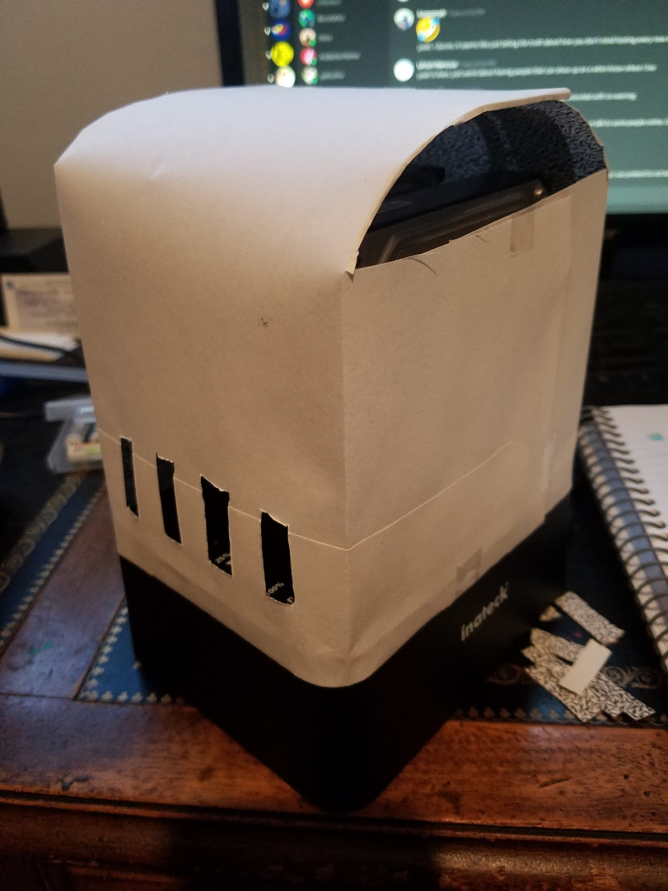

# Yet Another Raspberry Pi NAS/Server Thingy

Sunday, November 1, 2020

***Note from the future of 2025/11/06:** This post has been sitting as a draft since 2020. Suffice it to say, this post was very unfinished, but I no longer remember the details after so many years and have decided to publish it in its unfinished state during my move from Blogger to GitHub for historical reasons.*

---

So a friend of mine sent me 5 1TB 3.5 inch hard drives (for which I will be eternally grateful). I figured that I can't just have them sitting in a box, and I've always wanted a NAS type thing, so I should make one with 2 of the drives. This would allow me to set it up so the drives are mirrored for data reliability.


Parts:

https://www.amazon.com/Inateck-Dual-Bay-Docking-Function-FD2002/dp/B00N1KXE9K/ref=pd_sbs_147_5/143-5801579-2664760?_encoding=UTF8&pd_rd_i=B00N1KXE9K&pd_rd_r=b7ba0ac3-3b9d-41cc-95a9-e27ecad08fbd&pd_rd_w=eNCYf&pd_rd_wg=0x8PX&pf_rd_p=b65ee94e-1282-43fc-a8b1-8bf931f6dfab&pf_rd_r=84SB8NRFDXZ1BP2JW4F0&refRID=84SB8NRFDXZ1BP2JW4F0&th=1

https://www.amazon.com/Raspberry-Model-2019-Quad-Bluetooth/dp/B07TC2BK1X/ref=sr_1_3?dchild=1&keywords=raspberry+pi+4+4gb&qid=1602978850&sr=8-3#

https://www.amazon.com/Miuzei-Raspberry-Power-Supply-Heatsinks/dp/B089NQBBBK/ref=pd_sbs_147_7?_encoding=UTF8&pd_rd_i=B089NQBBBK&pd_rd_r=f1e4e57c-ae5c-4cd0-a6fe-a0ffb8663ec4&pd_rd_w=kraMW&pd_rd_wg=mhyfR&pf_rd_p=b65ee94e-1282-43fc-a8b1-8bf931f6dfab&pf_rd_r=WK7GYQQX3ZRA395KT5Y8&psc=1&refRID=WK7GYQQX3ZRA395KT5Y8


$113.42 with tax

 

RPI Setup:

Ubuntu Server 20.04 64bit for Raspberry Pi 4

Downloaded as ubuntu-20.04.1-preinstalled-server-arm64+raspi.img.xz, double clicking brings you to this window to conveniently flash it to the sd card, don't even need terminal with dd and it gives you a nice little progress bar.


Connect to ethernet to begin wifi config

Use nmap to scan network like haxxor

SSH in with `ubuntu@<ip address>`

Change your password

Follow this tutorial to set up wifi: https://medium.com/@huobur/how-to-setup-wifi-on-raspberry-pi-4-with-ubuntu-20-04-lts-64-bit-arm-server-ceb02303e49b

Use this config for static:
```
network:
    version: 2
    renderer: networkd
    ethernets:
        eth0:
            dhcp4: true
            optional: true
    wifis:
        wlan0:
            dhcp4: no
            addresses: [192.168.1.123/24]
            gateway4: 192.168.1.1
            nameservers:
                addresses: [8.8.4.4,8.8.8.8]
            access-points:
                "MySSID":
                    password: "mypassword"
            optional: true
```
change MySSID and mypassword for you password, also change ip numbers to be whatever you want

DONT FORGET the network: {config: disabled} line from the tutorial

do sudo netplan generate, then sudo netplan apply

Reboot and hope it works

!!! do the steps in the followup if you don't want problems !!!


RPi Case:




Dust Shroud Design:


asdf


fdsa


No dust shroud because slicer says over a day of printing for this, still 8 hours when grabby part is removed and layer height is brought to max



jank af paper cover


RAID Setup:

Follow Step 5: Setup RAID 1 Mirror of https://www.instructables.com/New-Raspberry-Pi-4-USB-30-Personal-Cloud-With-RAID/

After reboot it wasn't working, looks like a /dev/md127 was created instead of /dev/md0

Looked at this to see how to fix it: https://unix.stackexchange.com/questions/411286/linux-raid-disappears-after-reboot

Run this command to get the uuid of the raid disk
```
ls -l /dev/disk/by-uuid/
total 0
lrwxrwxrwx 1 root root 15 Oct 26 02:51 483efb12-d682-4daf-9b34-6e2f774b56f7 -> ../../mmcblk0p2
lrwxrwxrwx 1 root root 15 Apr  1  2020 B726-57E2 -> ../../mmcblk0p1
lrwxrwxrwx 1 root root 11 Apr  1  2020 a9ab08b1-4760-4219-964c-ee2ddc436119 -> ../../md127
```

Modify fstab to  use the uuid instead of device name
```
cat /etc/fstab
LABEL=writable    /     ext4    defaults    0 0
LABEL=system-boot       /boot/firmware  vfat    defaults        0       1
UUID=a9ab08b1-4760-4219-964c-ee2ddc436119    /mnt    ext4    defaults    0 0
```

Success, after multiple shutdowns and reboots it seems to be available on /mnt now

Now run `crontab -e` and add `@reboot chmod 777 /mnt` to the end of the file


Set Timezone: \
`sudo timedatectl set-timezone your_time_zone` \
https://linuxize.com/post/how-to-set-or-change-timezone-on-ubuntu-20-04/


Turn off unattended upgrades: \
https://unix.stackexchange.com/questions/374748/ubuntu-update-error-waiting-for-unattended-upgr-to-exit

Followup:

So it's been a few days and it worked good for about 3 days, but then the wifi cut out and wouldn't really reconnect by itself or after reboot. \
Turns out this is due to the answer in this stackoverflow: https://raspberrypi.stackexchange.com/a/116070 \
Looking through the dmesg messages gives me this output:
```
dmesg | grep power
[    0.207829] thermal_sys: Registered thermal governor 'power_allocator'
[    1.603400] bcm2835-power bcm2835-power: Broadcom BCM2835 power domains driver
[   26.808207] brcmfmac: brcmf_cfg80211_set_power_mgmt: power save enabled
```
Nothing about wlan0 interface which is giving me problems, so this confirms it.

Doing the "switch ssid and netplan apply" trick only makes another "power save enabled" line \
Adding crontab entry to turn off wlan0 power management didn't work either

could be hdmi interference (not using it) or attenuation of wifi signal (either can't get there or can't get back)

Flashed new sd card, set up wifi, worked even with the "power save enabled". \
Attempt to update and see if an update broke something


Turns out to have been wifi country code issue and ssid issue, changed country code to US and switched to 5g and it worked \
Figured from this, talks about using 2.4GHz (5GHz in my case) and checking country code: https://bugs.launchpad.net/ubuntu/+source/linux-firmware/+bug/1862760 \
Use this to persist country code: https://askubuntu.com/questions/503416/wifi-country-changed-to-us-how-do-i-change-it-back

<sub>Posted by [koppanyh](https://github.com/koppanyh) on 2020/11/01 at 3:33 PM PDT</sub>

<sub>[Permalink](https://blog.kh-labs.org/2020/11/yet-another-raspberry-pi-nas)</sub>
