# Project Pixie Stix: Making Rechargeable LED Spinning Pens

Sunday, June 26, 2022

***Note from the future of 2025/11/07:** This post has been sitting as a draft since 2022. Suffice it to say, this post was unfinished, but I no longer remember the details after a few years and have decided to publish it in its unfinished state during my move from Blogger to GitHub for historical reasons.*

---

Hello again, it's time for another instalment of "Koppany wastes too much time and effort doing something probably not useful"!

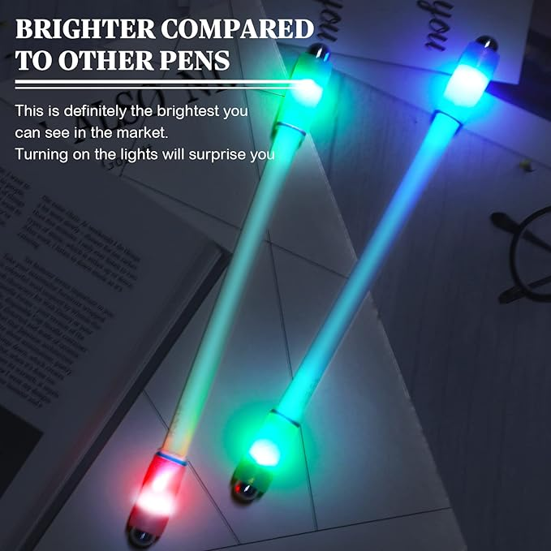 \
Image of pens from Amazon listing: https://www.amazon.com/dp/B09M832BHN

So I bought these [really cool LED spinning pens](https://www.amazon.com/dp/B09M832BHN) at the beginning of February. They're longer and have better weight characteristics than my previous pens. They also light up and flash or fade through colors. I highly recommend them and they look absolute sick at raves (take that, poi people! I can never be as cool as you but at least I got lights that spin too!). I spent most of February learning how to spin them to music (harder than it sounds) and then I went to go see Da Tweekaz (and others) at [Basscon Wasteland](https://wasteland.bassconmassive.com/). This would be my first real test of these pens. This would also be where they died.

I got really good data from that event. The batteries died after about 4 hours, which was fine since I was only using half of each pen at a time, so I was able to effectively double it to barely get through Saturday. These use a stack of 3 LR41 cells per LED module and my estimates put the light output at about 5 or 6 hours before running too low to be useful (I used up 1-2 hours worth of light with all that practice before the event).

I guess that's not bad, but that's like barely enough for a single night of partying. What about multi-day events? What am I supposed to do, carry around a ziploc baggie filled with LR41 cells? Unacceptable.

I did a technical breakdown for a friend to explain the construction of the pens, and I realized that these are a marvel of pricepoint engineering. Below is a diagram of each led module. The LR41 cells are bound with tape to hold them in place and provide insulation, the tiny PCB just has an automatic RGB LED and contacts on it (one that's just a solder ball, the other is a ring of copper trace). When you screw the casing down, it causes the battery to move down and complete the circuit, using the case itself as the anode. This is a super cheap design, but causes problems when you realize that the case is a tiny screw press. It can cause the cells to press against the pcb too hard which not only dents the bottom cell, but also flattens the little solder ball (since it's probably the cheap leaded stuff, which is very soft metal). This in turn actually makes the contact harder to establish since the contacts are being bent out of shape. To add insult to injury, the solder they used seems to form an oxide coating very easily, so that makes the circuit harder to establish, and the exposed copper trace they use at the bottom to connect with the casing also forms its own oxide layer since it's raw untreated copper! Because of this, I'm not surprised that these were super cheap on amazon, about $5 a pen, of which a large part of the cost probably went into machining those little screw casings.

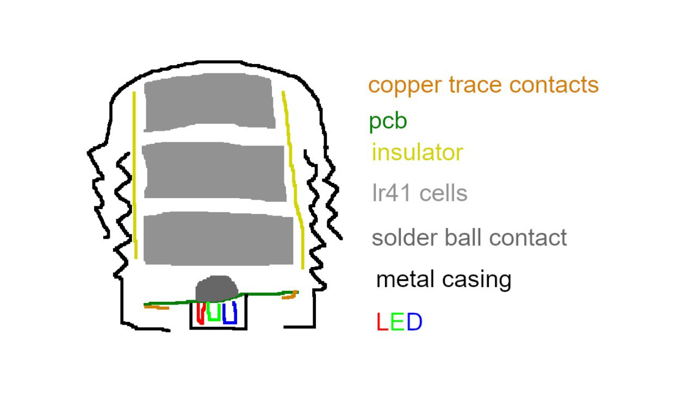 \
Diagram of construction of LED module

Being the nerd that I am, I figured I could make them rechargeable somehow (they are very simple, after all). I went that route with my Oculus Quest (yes, the original model) controllers and used rechargeable NiMH AA batteries (which don't last as long, but I always keep a box of charged ones in the carrying case, so I've never had an issue of not having batteries for the controllers). So I looked into rechargeable LR41's and then promptly looked away. Turns out there's not much of a market for these outside of hearing aids and the cells are really expensive and low capacity, and the charger is even more expensive (because medical pricing). So screw that, I'll figure something out.

I decided to look into supercapacitors. I was sure I could find something small with enough capacity to run the pens for at least 10 minutes and just recharge them in seconds when they run low to get another 10 minutes out of them. With that, I could have a custom charger strapped to my belt and when the pen runs low, I just hold the contacts of the pen against the charger for a few seconds and then I'd be good for a few more minutes. Easy peasy.

So I got to work running a few tests so I could spec out a capacitor to use as a drop-in replacement for the LR41 stack. First was power characteristics. At 4.1V, the pen would draw about 7mA average with peaks of about 14mA. At 4.7V (slightly overvolted), the pen would draw about 14mA average with peaks of about 30mA. Then I tried charging a 0.22F capacitor to 4.5V and see how long it would run the pen. I got good levels of light for about 3.5 minutes, with the output being considered bright down to about 2.5V.

I figured I would aim for at least 1F (I didn't do exact calculations due to the current draw not being constant at all), that would definitely get me at least 10 minutes (extra time is always good), so now it was just the task of finding capacitors that could physically fit inside the casing. I browsed all the usual places (Digikey, Mouser, Ebay) and found that it was actually really hard to find capacitors that would fit and had the required capacity. One thing that stuck out was a strange gap in capacity, it would jump from less than 1F to +3F, with not much in the middle. A 4F capacitor wasn't that much money (about $2 a pop), and it would fit (just think how long those could run)! So now I just had to order some. This was hard. The minimum orders were large and I didn't need 50 capacitors for over $100.

Desperate, I searched on Arrow, and surprisingly, this was the only place that would sell what I needed in minimum quantities of 1 (but it was hard to find because their UI still sucks). Even though I vowed never to use Arrow again (after they lost my last payment somehow (it was through PayPal, how do you lose that?!?!) and spent weeks hounding me to pay after they had sent me the parts I ordered), I didn't have much of a choice. Surprisingly, the capacitors arrived extremely fast and packaged very nicely.

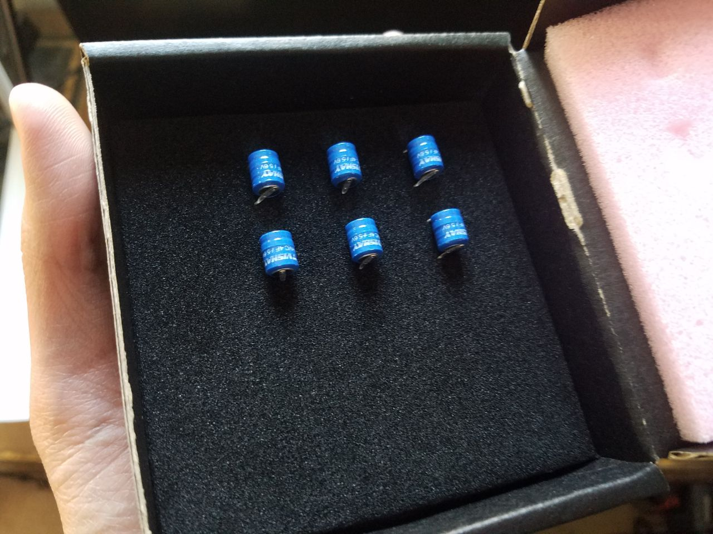 \
Capacitors packaged in foam, in a box... which was itself wrapped in packaging paper in a bigger box

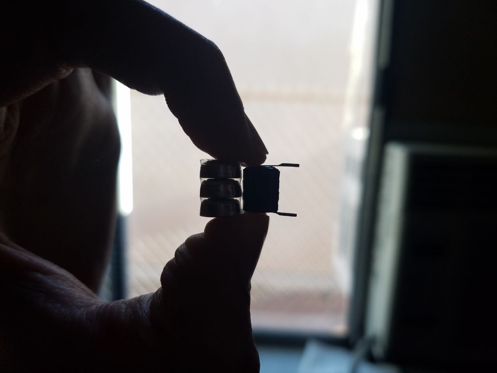 \
Capacitor next to the stack of LR41's that it was going to replace

It was hard to believe that we had the technology to make 4F capacitors this small. And they were even slightly smaller than the cell stack they were replacing. It was truly a moment of realizing how amazing the future was. The part number is MAL219691124E3 if anyone is interested.

This is when the trouble began.

I had bought 6, because I needed 4 (one for each module,) and I figured 2 to play with without worrying about breaking them. I started experimenting on one of the spares and quickly found out that these didn't behave like any capacitors I'd ever encountered.

Of course, physics is the cruelest mistress (and I'm generally beginning to hate her), turns out that we don't actually have the technology to make such huge capacitors this physically small. Turns out these are "hybrid energy storage capacitors" which is the lovechild of a battery and a capacitor. This explains the weird disparity between rated capacitances up above, because after a certain capacity they stop being normal capacitors and start being these hybrid battery thingies. This also explains why the rated ESR is 30 ohms (capacitors generally have much much lower internal resistance so they can dump their energy very quickly), and also why they have a rated lifetime and charge cycles.

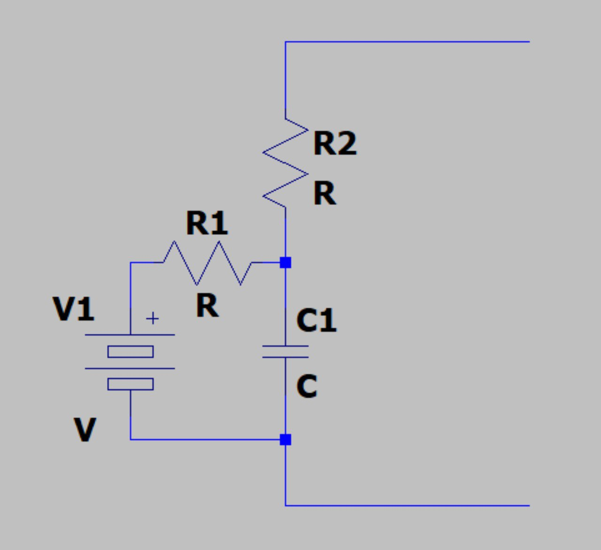 \
Equivalent circuit of these capacitors

My experiments showed they had a lot of memory effects and non-linear behavior. It seemed like the circuit above could model the behavior since it can discharge fast-ish and then be at low voltage, but leaving it alone would let it charge back up by itself so you could discharge it again. They act more like crappy lithium cells than capacitors. The voltage drop is also rather linear within a certain point.

I was forced to actually read the datasheet on these parts to figure out how they should be charged. The max charge rate is 14mA with 2-8mA being recommended. There was a diagram that seemed to indicate you could charge it at a constant 5.6 volts until the current draw reached below 1mA and then it would be considered charged enough. The max discharge rate is rated for 25mA, which is good since the prior tests showed that the LEDs consumed less than that. (Upon writing this section, I looked at the datasheet again and found out you're not supposed to discharge the capacitor below 3.2 volts. Oops. So it really is like a little lithium cell. Fortunately, the voltage would always creep back up to about 4 volts if left sitting, so hopefully that means the torture I put it through isn't hurting it... at least not that bad.)

I whipped up a quick little circuit to basically short the output of a 4.5 volt regulator with the capacitor, with a multimeter to monitor the current draw. The current quickly dropped to within 3 to 4 mA in a matter of seconds, so it seemed there was not really a risk of destroying it in this manner.

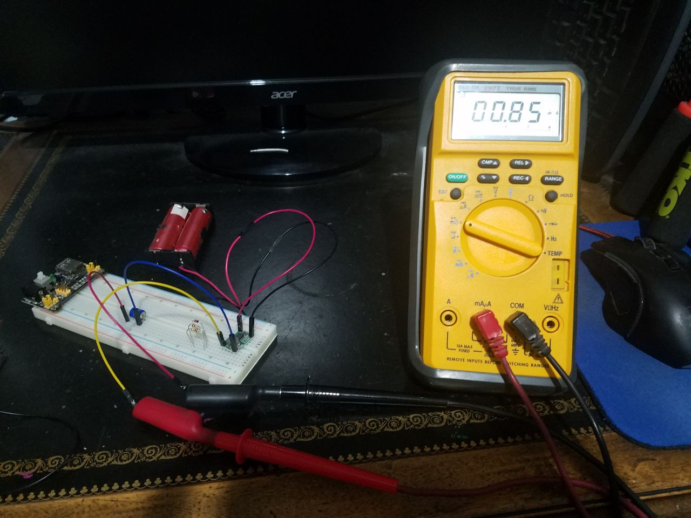 \
Rudimentary charging circuit

I connected the capacitor to the pen directly since the pen was rated at 4.5 volts, and the light turned on. It also quickly dimmed after a few minutes. As a crappy lithium cell, it made sense that it would have to be charged to a specific voltage to be considered full (not like a normal capacitor) and that ended up being 5.6 volts. Unfortunately that's 1.1 volts over the pen's rating, so I used 2 diodes in series to drop the voltage by about 1.2 volts. This let me get about an hour of light (although past 30 minutes it was very dim, and by the end of the hour, only the red LED was still on, and almost imperceptible at that).

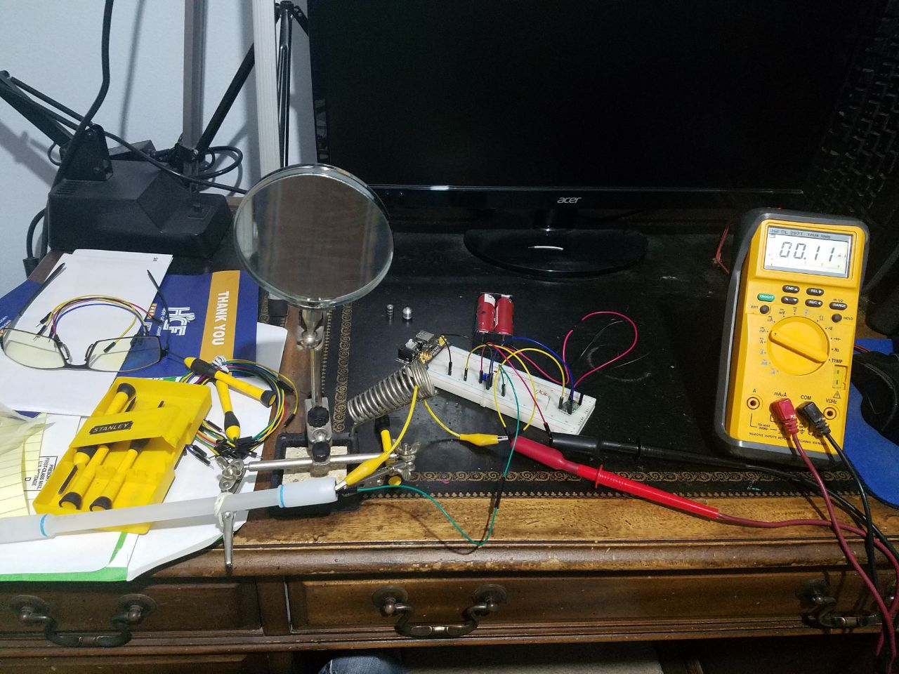 \
The setup with the pen and diodes (please ignore the messy desk)

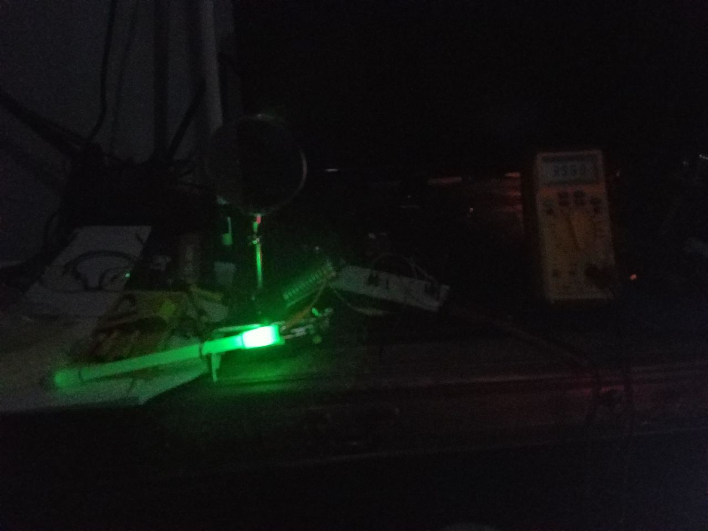 \
The pen running off of the capacitor's power

So now I could technically power it for an hour, but barely. Realistically it was more like 30 minutes of useful output with the 2nd half hour only technically generating light.

I tried this a few more times, charging the capacitor at 5.6V until the current draw hit around 1mA (would usually take less than an hour), and then letting the pen run for as long as it could, timing when the blue, then green, LEDs would stop working as the voltage ran down. I got mostly the same data. It wasn't looking too good, which was a shame since this charge-discharge cycle takes at least 2 hours to run so I'd usually run only one test per day after work.

I decided to try using a resistor instead, maybe limiting the current that way would give me better results than dropping the voltage. I hooked a potentiometer to the charger's 5.6V output and slowly cranked down the resistor until the average voltage drop across the LED module was 4.5V. This was around 280 ohms.

I ran the test in a similar fashion. Charge until the current draw hit 1mA, then discharge until the blue and green LEDs failed. The results were similar, but slightly worse, so I decided to proceed with the diodes.

I would change the charging strategy to better replicate the actual conditions that were expected. Music sets are typically about an hour, so I could have 2 capacitors running the pen while 2 where in the charger, then swap them at the start of the next set. So charging would be based more on time than current. As such, I decided to try the diode test with an hour of charge time.

Somehow I failed to stop charging after an hour and went 15 minutes over. The pen ran for 45 minutes before the blue LED stopped, and 1 hour 13 minutes before the green LED stopped. This was better, almost a whole hour of full color runtime.

Out of curiosity, I decided to try the resistor test again to see if the results would be any different with an hour fifteen of charge time. Surprisingly, yes. I got 54 minutes of blue output, with 74 minutes of green output (comparable to the previous diode test). This was closer to the hour I was aiming for. The light intensity falloff was sharper at the end, but that was after the rated hour, so I didn't really care. This was enough to convince me to attempt to proceed with a resistor instead of diodes.

I spent about a week running tests with different resistor values, cranking it up a bit each time to see how the light output was affected. I'd pick the resistances based on the values of SMD resistors that I had on hand, so I'd know which ones to use in the final product.

All tests were run with an hour of charge time. I started with 300 ohms, the next step above the initial 280, and got 48 minutes of full runtime. Then I tried 390 ohms and got 55 minutes of full runtime. I was starting to get close. Then I tried 510 ohms and for some reason the charger stopped halfway through, so I had to scrap that test and discharge the capacitor until it was about the same starting voltage. That took the rest of the day, so I ran the 510 ohm test again the next day and got 65 minutes of charge time. Bingo! I also found out that the 18650 pair's voltage would only drop 40mV or less per charge, so that should be enough for a lot of capacitor charging before the charger itself needed to be charged.

Unfortunately, I blew the fuse on my multimeter during that last test because part of the test required measuring the starting voltage of the 18650 pair that was running the 5.6V buck converter module and I forgot to take the DMM out of current mode, effectively shorting the 18650s with the DMM. Luckily the fuse popped instantly, so no lithium fire, but also no precision current measurements. I tried to open the DMM and verify the fuse had popped, but I already had that test running, so I had to work against the clock to get it put back together before the next period of measurements came up. I didn't make it. When I opened up the DMM, a metal piece came out and I didn't know where it went, so I just put the DMM back together and it wasn't able to measure anymore. I got random numbers on basically all settings. Eventually I figured out that metal piece was a contact in the encoder wheel to select the mode and put it back and got the DMM working (minus the current measuring mode because the fuse). I missed the deadline, but at least could measure voltages for the rest of the test. [Here's a Twitter thread](https://twitter.com/koppanyh/status/1513037340314275841?s=20&t=TCr7wijqiy5JUnxEoAAA-Q) that talks about it, with pictures.

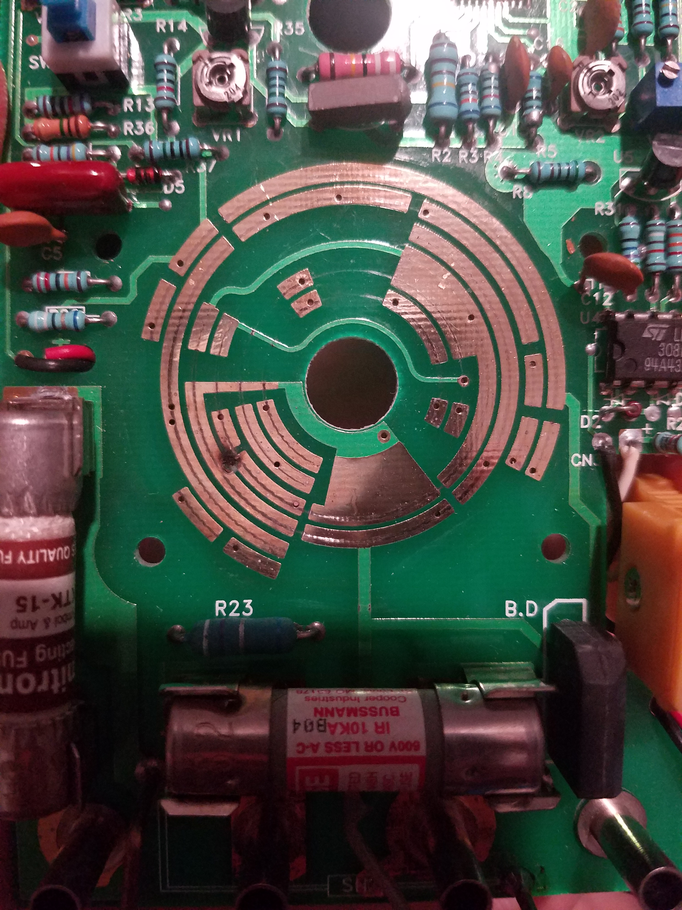 \
Picture of multimeter encoder PCB with tiny black mark where short occurred

I spent the rest of that night letting the pen run down from that final test and looking for a replacement fuse for the DMM. Turns out those little suckers are expensive if you need them fast. So with plans to get a backup multimeter, I figured I could afford the slow shipping for a much lower price. I went out to buy a multimeter the next day since the brief possibility of being without a DMM scared me to the point that I figured I should have a backup for what I consider the most important electronics tool.

I didn't want to run anymore tests since 510 ohms showed enough promise and I was starting to run low on time. I had an event planned at the beginning of May, and I had less than 3 weeks to get these pen upgrades made and build the portable charger for the capacitors, so I just had to commit to a resistance and hope for the best. Confucius said "it is better to have a spinning glowpen that dies a few minutes short than not having one at all" (ok, he didn't actually say that). If it ended up being a few minutes shorter, big deal, I could always use bigger resistors in the future.

After buying that spare DMM, I spent the day designing the little "interface disk" that would go inline between the capacitor and the LED module. The idea was simple, have a plastic disk with the resistor in the middle and metal contacts on the ends of the disk that were connected to the resistor inside. I designed it to be a little thick because the capacitor was shorter than the LR41 stack, and so this would also serve to pad the missing length. I also used the drawing as a prototype itself since coming up with assembly instructions showed me flaws in the design, which I was able to correct on the spot. Much faster than making all the pieces to find out that it can't actually be assembled.

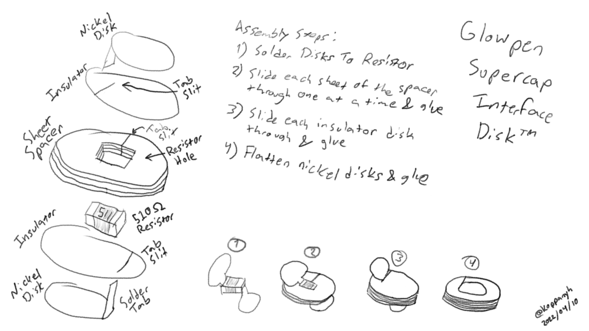 \
Hand drawn exploded diagram and assembly instructions of interface disk

In order to make the interface disk, I needed to get some kind of thin sheet metal that could be soldered. I settled on nickel sheet since it's a relatively common metal and it can be soldered and it doesn't corrode like other metals. I searched around and the only way you can really get nickel like that is as strips for spot welding 18650 cells together. The width of the average strips was large enough and I bought some of that, and paid a little bit extra to get it ASAP.

While waiting for the strips to arrive, I started to think about how the portable charger would be. The design is heavily based off of the quick-n-dirty charging setup I was using for the tests, but with 2 buck converters in case the capacitors aren't at the same voltage (so one doesn't backfeed into another). I also tried to incorporate a little testing device where the switch breaks the direct connection, and if the LED lights up, then that means the capacitor voltage is too low to safely be charged.

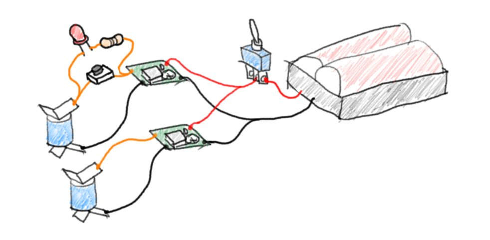 \
Drawing of approximately how the charging circuit would look

As of writing this, I realized a better approach is to have an LED after the switch to have a status of when the charger is on. I also figured I could move the testing circuit between the 2 caps to measure their voltage directly, for the cost of only a single extra push button. This way you can test either cell by pressing the button, and if the LED doesn't light up, then you know the cell voltage is too low and can just store it until returning from whatever event to charge it under DMM supervision.

Since I had time, I also designed the layout of the charger circuit. This way the charger could just be a little 3D printed box with some kind of lid you can pop off to be able to plug the capacitors in to charge. It could be kept in a pocket while in active use so you could "hot swap" the capacitors as needed on the dance floor (maybe, not sure how hard it would actually be in practice).

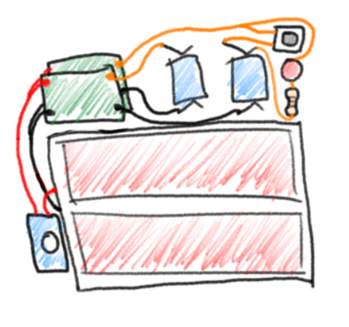 \
Drawing of approximate layout for charger circuit

When the nickel strips arrived, I immediately got to work trying to make a prototype interface disk, right after my work shift ended. I cut out little paddle shapes that had tabs on them about as wide as the resistor that they'd be attached to. The resistor was an 0805 part, which I remember as being really big when I learned SMD soldering years ago, but now it seems so freaking tiny.

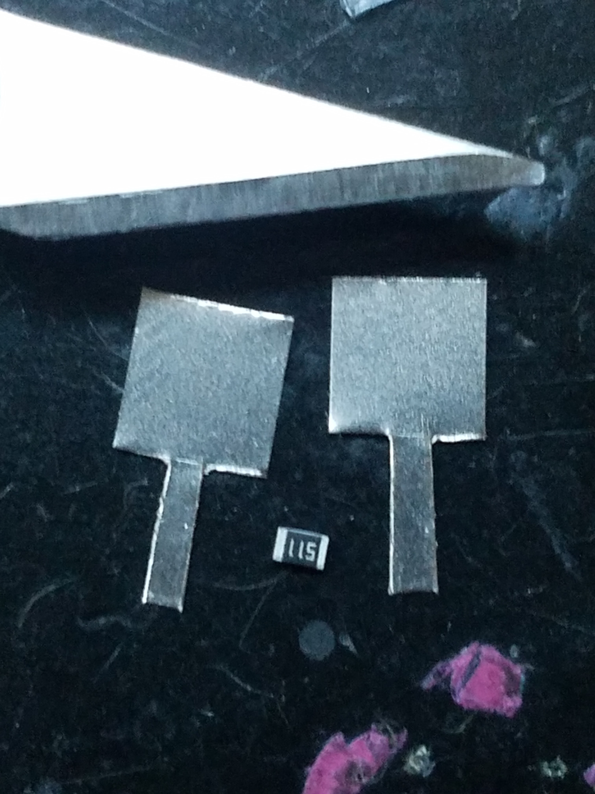\
Tiny nickel "paddles" next to an 0805 resistor, Xacto blade for scale

I set up my little soldering fume hood (actually just a cardboard box with a vent hose to a fan that exhausts outside) and played around with trying to solder little strips of nickel together. Turns out you need flux. I didn't have any on hand (my flux pen died probably over 2 years ago and I haven't ordered a new one), but I did find a jar of what looked like old plumbers' flux. It said "acid free" and "general purpose", so I figured it would be safe enough to use for electronics. With a bit of flux I was able to solder the nickel scraps together with no issue. Armed with that knowledge, I soldered the tabs of the paddles to the resistor. It was actually not that bad.

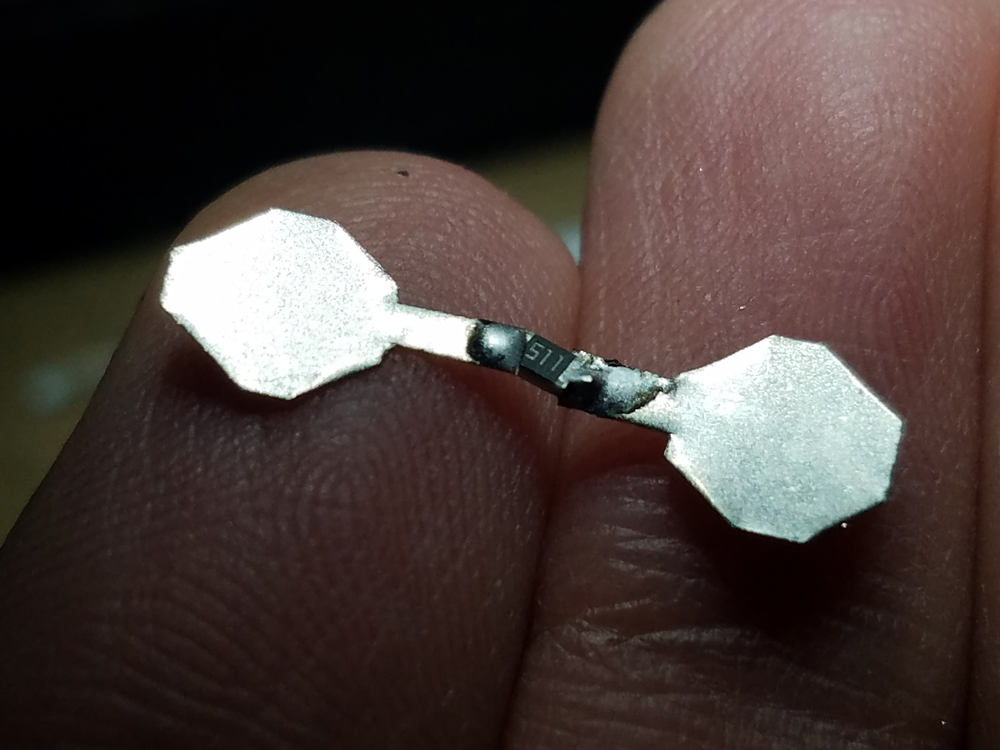 \
SMD resistor with paddle-shaped contacts soldered on

I started to bend the paddles using SMD tweezers so it'd be in the shape it needs to be (same as the diagram, but without the plastic supports) and one of the joints popped off. Maybe it was cold and weak, so I tried to solder it back on and it just wouldn't solder anymore. Eventually I scrapped that resistor and tried again. Same issue, the joint popped off and couldn't be soldered back on. Ok, third time's the charm, right? So I tried yet again and the exact same thing. Something was up. Turns out that the metal endcaps of the resistor themselves are what were popping off, not the joint. Apparently they can't take torsion forces at all and will pop off, but the end of the resistor will still look metalized when not viewed through a microscope (which I don't have, not the soldering kind at least), so I thought the endcaps were still there.

At this point I started to worry, it had been over two hours and no success. I killed 3 whole resistors with nothing to show. My design had failed before it had even really started. I didn't want to panic, so I cleaned up a little and started winding a coil out of solder wire to refill my solder dispenser tube. While doing that, I was thinking about what else I could try that would work. I even consulted some engineering friends about this issue. One of them suggested that I was trying to use resistors in a way that they weren't meant to be used (can you believe that!?! the nerve!... but he was kinda right), and it was definitely helpful to "rubber ducky" this problem against them.

I figured that if bending wasn't possible because of the forces involved, then maybe I could build it in a way where the resistor is soldered flat to one disk, then another one soldered above that, kind of like a nickel-resistor sandwich (just like gramma used to make) so that no bending would be required. The only problem with that is that there would have to be some way to mask off the each contact of the resistor from the disk it's not supposed to touch, otherwise current could just pass from one disk to the other without going through the resistor. I thought about using Kapton tape and just cutting out a little square where the resistor needs to make contact, but I didn't have any, and I wasn't going to waste even more time ordering some. So maybe I could drill out a hole where the resistor shouldn't touch, but that would be hard to get right and it was late and setting that up would take too long and make too much noise. But that gave me inspiration. Maybe I could move the resistor to the edge of the disk and cut out the parts where there shouldn't be contact so that current would be forced to flow through the resistor, but no bending would be required to have the final product.

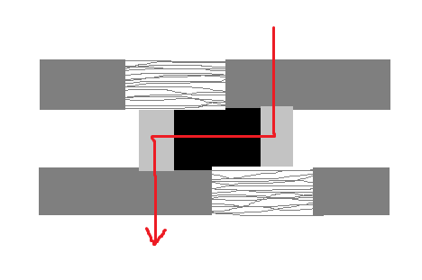 \
Diagram of the cutout idea

I got my set of really small files, found one with a good rectangular shape, and started filing away at the disk to create the little notch where the resistor shouldn't contact. In the picture below you see the notch with one half of the resistor on the metal, and one half hanging into the notch.

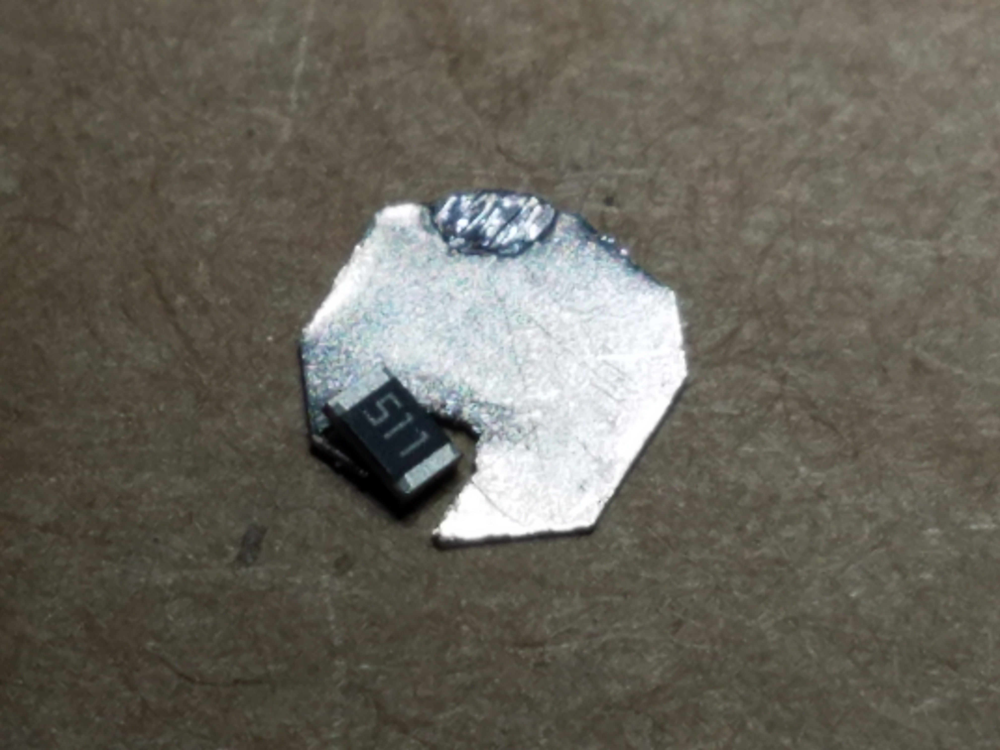 \
Disk with cutout to prevent contact

Due to the scale of the job, this approach would require more precision than I could conjure up. It was really hard to position the resistor and I realized it would be hard to solder the second disk on with the first one in the way. I modified this design slightly, removing a little more of the edge to have a little more clearance to work with, and allowing higher error in positioning. The below picture shows how that looks, with the nickel-resistor sandwich loosely stacked to get an idea of how it would look.

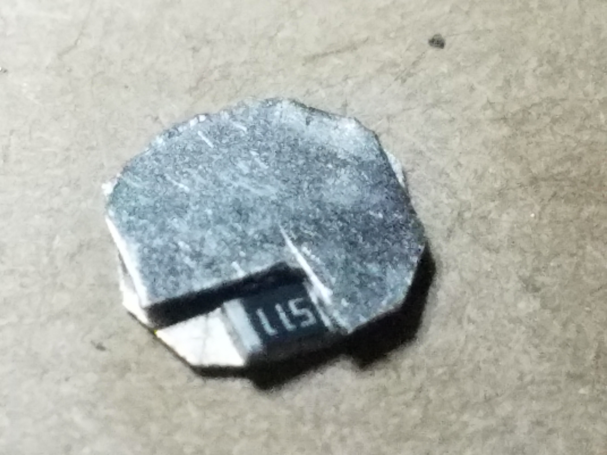 \
Larger cutouts for lower precision

I went ahead and soldered it together. I used a little scrap of nickel strip to support the bottom of the resistor so it would be level against the disk when soldered. Then I used SMD tweezers to hold the resistor and disk in place while soldering the other end of the resistor to the other disk. It actually worked!

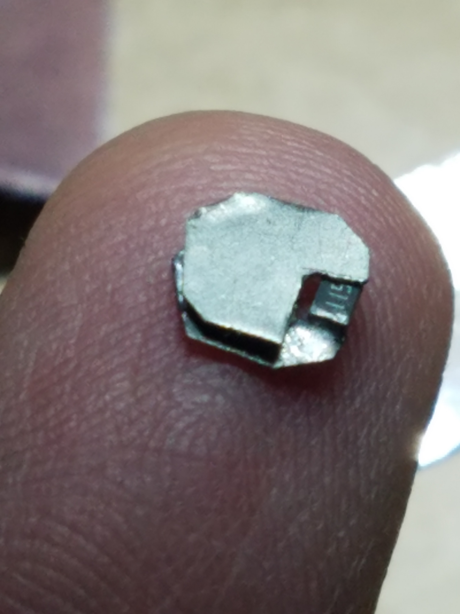 \
Assembled interface disk with fingertip for scale

And as luck would have it, I shortly broke it by snapping off one of the resistor's metalized endcaps while trying to stuff 2 layers of plastic sheet between the 2 disks to act as mechanical support and an insulator. The same torsion failure as the first 3, so the body-count for resistors is now at 4. I quickly replaced the resistor and put in only a single sheet of plastic. Hopefully the compression of this disk by the screw casing of the LED module wouldn't snap the endcap off.

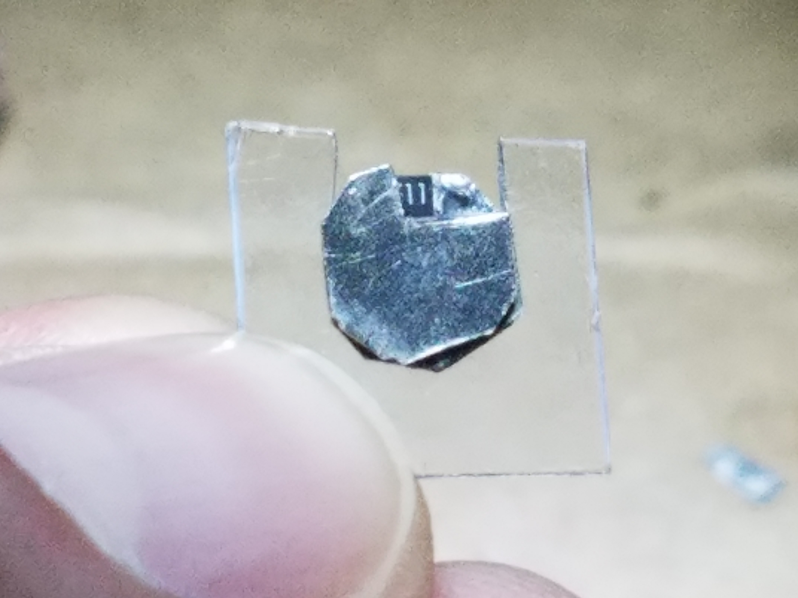 \
Interface disk with plastic insulator

I cut the plastic to be rounded and fit into the screw casing, then I put the capacitor and interface disk into the pen. I had to wrap the capacitor in paper to prevent the terminals from touching the casing and shorting it out (I'll be removing the terminals from "production" capacitors) and then add a little piece of nickel sheet to the end to pad the space since this version of the interface disk was thinner than originally planned. The pen worked. Success. Finally. I could go to sleep.

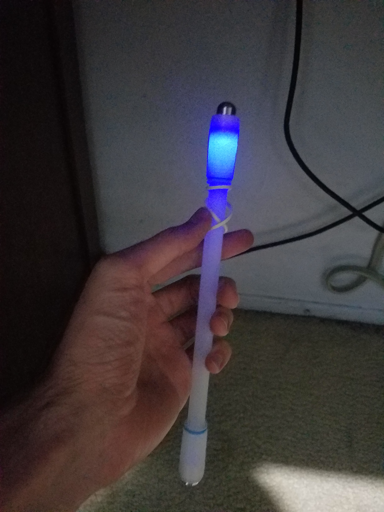 \
Pen running off the capacitor, self contained

I did a real test the next day by charging the capacitor for an hour and then putting it into the pen. The pen actually ran in full runtime mode for well over an hour, so I was happy. But there was this weird glitch where if I screwed the cap tighter than a certain point, then it would act as if there was a high resistance contact. This was weird but I figured maybe the LED module has defective and bending from the force caused a solder joint to not make full contact or something. I moved the disk and capacitor to a different LED module and it worked flawlessly.

At this point, I decided to focus on the charger design. Turns out the previous sketch was so not up to scale that the layout didn't make much sense when playing around with the physical components. So I quickly made some lo-rez mockups of the components so that I could test out their layouts and how the casing would be made. I came up with the image below. The front (left) has the contacts for the capacitors, underneath that is a buck converter for each capacitor. Then there is the switch and the power indicator LED, with plenty of extra space to route the wiring. Then there is the 18650 pack. Then little compartments to hold spare capacitors and extra interface disks and backup LR41 stacks. The case would use a sliding lid to close it off and the capacitors would be the first thing exposed for quick swapping. Ideally there would also be rounded corners since this is designed to fit in a pocket (and 3D prints can be sharp). I decided not to include the "cap voltage too low" safety feature because it would've required more space and made assembly harder. I'm working against the clock on this project, so I'll consider this good enough for version 1.

After a bit of thinking, I realized I could make a tweak to the capacitor holders: by turning the capacitors 90 degrees, they could be made to share a common ground electrode, and so I'd reduce the wire count and make assembly slightly easier. The picture below is what I ended up with.

 \
3D render of charger components layout

I stayed up really late the next night, a Sunday night, designing the actual CAD model for printing because it kinda had to be printed by Monday the next day or risk waiting until the following Saturday to be home all day to supervise the printer (because I'm paranoid of starting a fire when I'm not home). With such a looming deadline and knowing that it would take many hours to print, I did what it took to get it done without waiting a whole week.

Much of the time that day went into looking at how 3D printed sliding lids work and then on the design in OpenSCAD. I went the full parameterization route with no hardcoded numbers in the actual code so anything could be tweaked on the fly. Of course, this made it slower to design, but it made it faster to adjust as needed. It was also my first ever attempt at designing a sliding lid and I was surprised by how easy it was to do. By the end of it, the exported STL fit over the previous lo-rez render so well that it's not even worth showing a picture of it, because it looks essentially the same.

At this point it was almost 1am in the morning (very late for me when I have to wake up at 6am for work), so the plan was to slice it and save the G-code to an SD card so I could start the print first thing in the morning when I woke up. I knew there had to be an error somewhere (because that's usually what happens when I design things so late at night), but there was nothing I could see. This is the hardware equivalent of your code compiling on the first try... Suspicious. I booted into Ubuntu (because I don't feel like setting Cura up in Windows) and loaded the STL into the slicer and hit slice. I was greeted with the horrific print time estimation of 18 hours! Even if I started as soon as I woke up, it still wouldn't be done in time for me to go to sleep that night. Unacceptable! So I tweaked the settings to use a 0.2mm layer height which brought the print time down to 6 hours. Since this was supposed to be a rugged case for a dancefloor environment, I decided to up the infill to 50% and that brought the print time up to 7 hours. Still good. I saved the G-code tot he SD card and went to sleep.

 \
The 3D print layout in Cura

I woke up and started the print right before starting work (it was a work-from-home day for me), I figured it could print while I worked and would be done roughly when my shift ended. This way I could make sure there were no fires, take care of any print errors, and I wouldn't have to worry about wasting precious precious personal time to run the print when I could be using that personal time to post-process and assemble the device (not that I'd have 7 hours free after a work day).

When it started printing, I realized just how massive the device would be. I knew it was big, but the renders didn't do it justice. It took half an hour just to print half of the raft. I let the printer chug away while I worked. At one point it sounded like a sci-fi jackhammer. This is why noise-canceling headphones were invented.

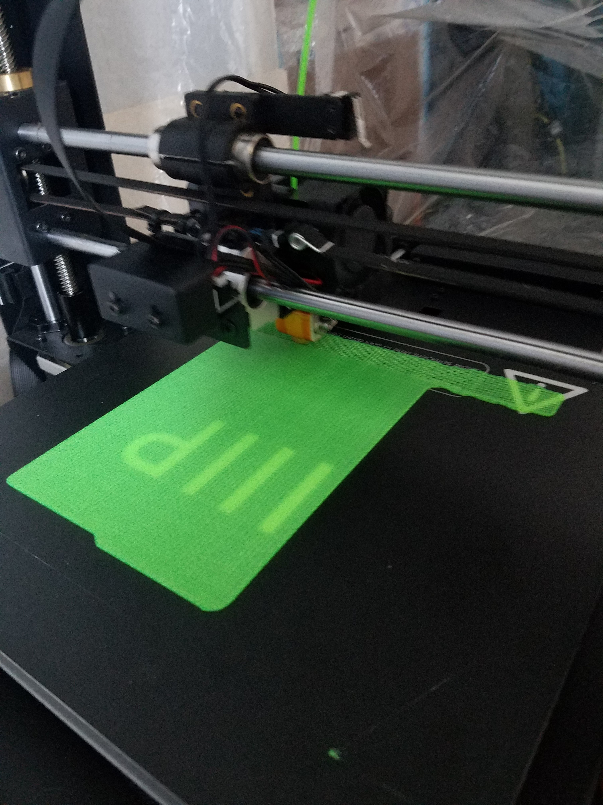 \
The raft on the print, also where I saw the scale of the device

About halfway through the print I realized that I had designed it with the lid sliding out in the backwards direction. The plan was to have it so you only need to slide the lid off a little to get access to the capacitor holders for quick swapping, but instead this mistake makes it so you have to pull the lid off completely to get access to the capacitor holders. Crap. There's the mistake I knew would be made but couldn't see... Oh well, it's not a deal breaker but it's not idea either. I'd just have to hope for the best since it was too far into the print to start again. Fortunately, the highly parametric nature of the design file meant I could reverse the lid direction with minimal changes, so version 2 might come out correct in the future.

The print finished in about 8 hours 20 minutes, so almost at the same time I finished my work shift. I let the print cool for about half an hour since prior experience has taught me that large prints will warp if try to pull them off too soon, and I can't risk it on this project. Then I pulled it off and removed the raft. It was pretty easy because this print was large and rigid enough that I could peel off the raft without hurting any of the parts. Then I removed the "spider webs" and any burrs with an Xacto knife and put in the battery to see how accurate my measurements were. It fit in quite well with very little clearance, just as designed.

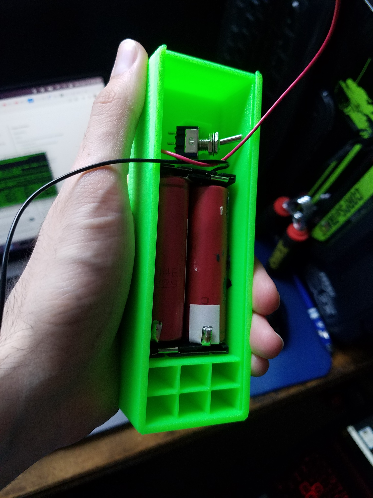 \
The cleaned case with battery pack and switch in for scale testing

The lid didn't fit since there was no tolerance designed into it (I was going for a tight fit and knew it would be impossible to know the perfect adjustment to make in code, so I just didn't add it in at all). I then went to go spend time outside (oh the horror) to do the necessary sanding of the lid to make it fit. I picked a rather coarse sandpaper so that the sanding would go quickly. A polished surface wasn't required or desired since I didn't want the lid to come on and off too easy, a light friction fit was what I was going for. I spent a bit less than an hour on the sanding, going slowly since I knew there was no going back with each stroke. Eventually it ended up just barely too slippery for what I wanted, but it was enough to hold itself on against gravity, so good enough. Nothing that a bit of sandpaper can't fix.

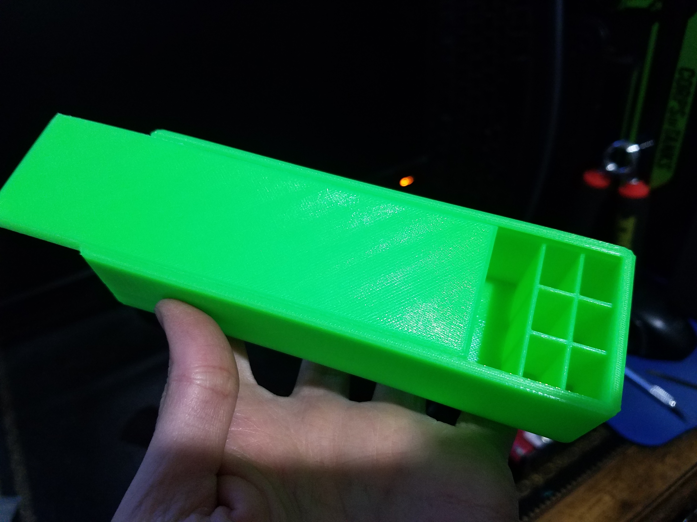 \
Case with trimmed lid to demonstrate fit

I called it a day and went to sleep early so I wouldn't crash at work the next day (you know, new job and all that, plus going into the office for the first time). Then on Tuesday I was busy, so assembly of the electronics had to wait until Wednesday. That's when I ended up staying up late yet again to get the electronics built, I even skipped taking a shower since there wasn't enough time. I used a point-to-point solder technique with extra long wires for added flexibility (I didn't want to deal with snapping off any joints or vias on the voltage regulators) with the contacts for the capacitor holders made from bent pieces of nickel strip. My design of the support structure for the switch was spot on! There was no glue or plastic welding required for anything, it all just fit together with friction, except for the switch which was anchored in place by the screw on the terminal. Even the distance that the switch lever poked out from the side of the casing was perfect.

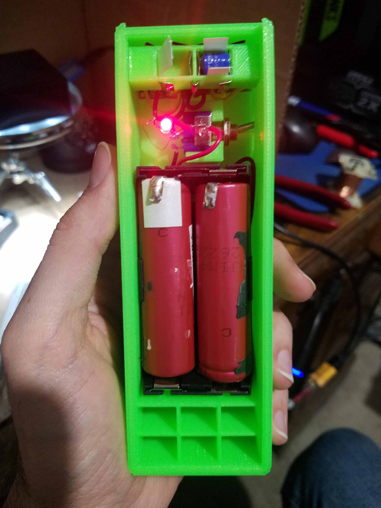 \
Electronics soldered together and crammed in the case

The resistor for the indicator LED was selected to give a nice dim red glow through the lid. This way it follows the philosophy of [Calm Technology](https://calmtech.com/) with the minimum amount of indication in a way that is not disturbing. It's bright enough to see in daylight, but not so bright that it's disturbing in the dark.

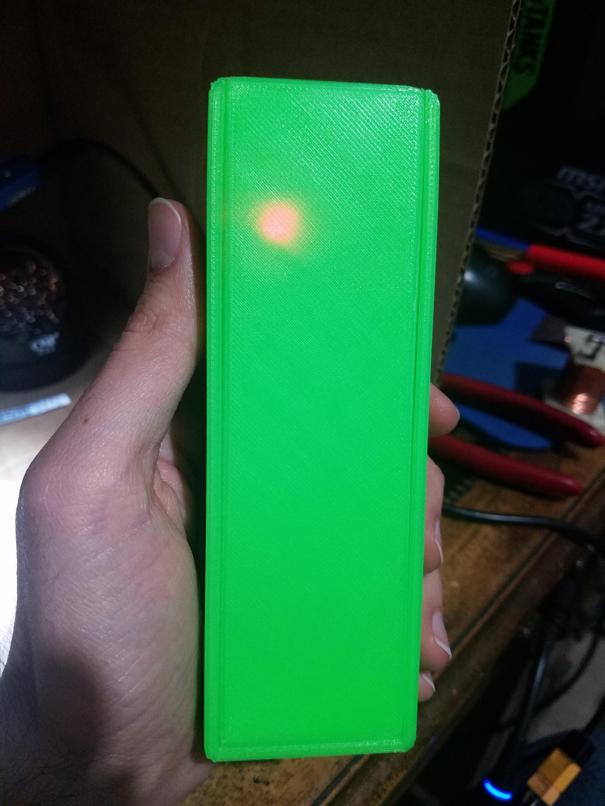 \
Indicator LED shining through lid

I took it to work the next day since I was telling my new coworkers about this great new project I'm working on. I figured that throwing it into my backpack and taking it to work by bus would be a really good test to see if the internals are as rugged as I hoped. I used a rubber band to hold the lid in place since I don't trust it to stay closed in a backpack. Not gonna lie, I was a little worried about starting a lithium fire if something came loose, but no, everything turned out ok. I showed it to my coworkers, they were impressed that I made it from scratch and I even got to demo the little indicator light to them. I also brought one pen and disassembled it to show them the scale of the interface disk, but for some reason it didn't really want to work when I put it back together. 

On the way home, there was no lithium fire either, so at this point I was pretty confident in the design. I didn't see any shifting of the components inside, so it looks like it would be good. Unfortunately, the movement seems to have broken off the wire connecting the indicator light. so I'd have to solder that back on better. It was a really thin wire since the LED was left physically floating with a thin enamel wire connected to an SMD resistor which was directly soldered to one of the LED's legs. It would be an easy fix... later.

The replacement fuse for my multimeter had arrived, so on Saturday I decided to install it before fixing the broken LED wire and making 3 more interface disks. 

Received replacement fuse, got to work on fixing led wire and making more modules

made 3 more, same procedure, only took 5 hours

One disk was DOA, another broke with careless exposure to magnets

Made 2 more, 1 kinda janky, different gluing technique

Prepping other caps, so discharged that can't plug into charger directly without precharging

Broke leads off and stuck into charger, added nice branding to charger

Toiler paper to storage to hold components down, also helps to keep lid closed

Defective capacitor, not as bright as others, doesn't reach same max charged voltage, constantly 2v lower than required. use as "spare tire", replaced with fresh one

Running tests, overdesigned, can run for about 1:20 on full charge, success

Went through TSA just fine, put 18650s in ziploc bag

very flaky, 2 disk failures, generally successful, felt very dangerous to have potential lithium fire in pocket

8.1v after event, nearly identical discharge

Future improvements: better charger (fix lid, CV-CC charging, indicators, reverse voltage protection, polarity protection, mechanically stable), more rugged disks, easier to plug caps in and out, design lr41 drop-in cell

UPDATE 2022-06-26: Bought a bunch of LR41 cells to "refill" pens for Basscon in a week. Not enough time to redo everything or at least make spare disks and didn't want to mess around with bulky system and battery swaps every hour.

asdf

Posted by [koppanyh](https://github.com/koppanyh) on 2022/06/26 at 11:05 PM PDT

[Permalink](https://blog.kh-labs.org/2022/06/project-pixie-stix)
