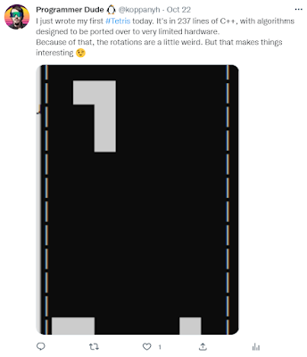
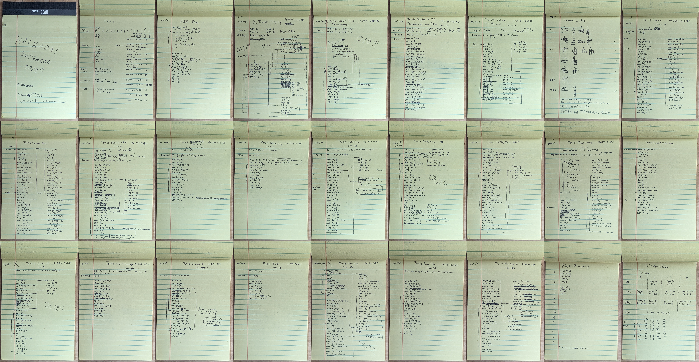

# Tertis, A Supercon Production

Wednesday, November 16, 2022

---

Two weekends ago (Nov 4-6, 2022), I attended the Hackaday Supercon for the first time. It was probably the most amazing con I've ever been to. It helped that the badge was something I really *really* wanted to play with, so naturally, I spent 2 weeks (actually the 4 days prior, because procrastination) reading almost all of the documentation so that I could be a good enough expert of the system. The badge was intended to be programmed by hand, so I decided to rise up to the challenge of writing Tetris for it by hand... on a yellow paper legal pad... with a pen (not a pencil)... and then entering it all in manually... like a madman... without any use of a computer for the entire weekend... because why not...

I had written Tetris for my first time ever in C++ 3 weeks before the con to get an idea of how it would work. In order to simplify the tetromino rotations, I picked one block to be the center and would rotate all the other blocks around that one. That made things interesting when rotating the square or the line. I decided to call the project "Tertis" (not Tetris) because of how jank it was seemingly going to be to play. But it actually wasn't bad. I spent half an hour playing it at 1 am on a workday.

 \
[Oops, all ANSI escapes](https://twitter.com/koppanyh/status/1583934076460838912?s=20&t=D0-0SKP3Vnvk1S-YUFF89Q)

(P.S. Because of the whole Twitter fiasco and the possibility of losing tweets or whatever, I'll be posting pictures of my tweets along with links to get to them instead of embedding the tweets directly. I don't think anything will happen, but just in case.)

Here's how it all went down:

## Friday

I got to the con super early to be one of the first 100 people to receive the poster. Naturally, I got there half an hour early... only to wait at the wrong building and trick a small crowd of people to line up behind me. A nice Supercon volunteer told us we were at the wrong place and where to go. We had to walk to the other building, but we still got our posters, so all was good. Whoops.

Since I hadn't had access to the badge before this, Friday was dedicated to figuring out all the little peculiarities of the architecture and testing my understanding of the manual. My first program just read from the random register and displayed it on the display in a loop, so I could test programming. For my second program, I one-upped a friend by whipping up a little routine on paper with 14 instructions that would just fill the screen with randomness for maximum blinkenlight effect, because his program only did half the screen. I'd end up passing this routine out throughout the con to people who just wanted the badge to do something; since it was open source, they'd just take a picture of my page of assembly. I'd later end up submitting this program as the first punch card for [another team building a punch card reader](https://twitter.com/im889/status/1590928302185013249?s=20&t=pHMUFSgJjOCnHutrWe5fhA).

.png) \
[It ain't much, but it's honest work](https://twitter.com/koppanyh/status/1588626824967622656?s=20&t=D0-0SKP3Vnvk1S-YUFF89Q)

.png) \
[No idea if I filled this in correctly](https://twitter.com/koppanyh/status/1589014505350385664?s=20&t=D0-0SKP3Vnvk1S-YUFF89Q)

With all the introductory exploration out of the way, I then started the design for Tertis. Because I'm doing it all on paper, and inserting newlines is generally not possible, I came up with a system in which I'd specify a staring address for each subroutine, write the subroutine, test it, then specify the end address as being a full empty 16 instruction page after the page containing the last instruction of the subroutine. This way if I had to change anything, then I had at least 16 instructions of buffer to insert things without breaking the defined addresses of any subroutines down the line. Took me a little bit to get this system down. This ended up having the happy result that if I started from the most primitive subroutines and worked up, then I could test each one individually as I wrote them, and the subroutines they depend on would've been tested already and would probably not need to change and mess up the addressing. I later added a listing with the registers used, so subroutines calling subroutines would know what was safe to use and what registers would be modified by the call. Also the size of the subroutines so I could know how many instructions would need to be entered in.

My first subroutine would start on 0x010, leaving 16 instructions at the beginning for initialization and jumping to the main program loop. This was to be a subroutine that draws a single pixel at a specified x-y coordinate on registers R0 and R1, with a "color" value (on/off) at R2. I quickly ran into the limitations of the processor. Turns out there's no way to programmatically set/clear a bit. You can set/clear a literal bit, but you can't set/clear a bit who's position is specified in a register. This made things messy and I ended up setting the least significant bit and just shifting it over in a loop as many times as needed before ORing (set) or ANDing (clearing) the bit on the specified display page. This was tested, and I could indeed set/clear a single pixel by the x-y coordinates.

.png) \
[Assembly intensifies](https://twitter.com/koppanyh/status/1588801340574425089?s=20&t=D0-0SKP3Vnvk1S-YUFF89Q)

I then wrote a subroutine to read a 4 element array of x-y coordinates from memory and draw it to the screen with the specified color in R3. The tetrominoes would be represented by the coordinates of their individual blocks, so moving/rotating would just require calculating the new coordinates for each block. This subroutine was tested by drawing and clearing the L tetromino over and over to test the max framerate and see if there'd be any flashing during movement. There was... with an update rate of less than 1 Hz. Not gonna lie, I was actually kind of pissed that it was midnight and that's all I had to show for all my hard work at the end of the day (remember that it's all written and keyed by hand). There was no way I was going to be able to do Tetris at that speed (none of the other necessary subroutines had even been written yet, those would only add more processing delay).

On the drive home, I was talking with my friend (the same one who's random blinkenlight routine I rewrote) and he suggested using using a jump table like how the [Hamlet program](https://github.com/Hack-a-Day/2022-Supercon6-Badge-Tools/blob/main/examples/Hackaday-hamlet/hamlet.asm#L133) did for storing the relevant bits that created letters on the display. I figured it might actually be faster to calculate the table address to retrieve the bit I need set rather than do the shifting method. I'd do it tomorrow because this was a spicy subroutine and it was past midnight.

I got home and decided not to go to sleep. Instead, I'd continue badge badge hacking for a bit more. It was clear that too many loops were evil where pixel rendering was concerned, so I'd unroll the loop on the subroutine that drew the 4 x-y coordinate pairs. The subroutine ended up being twice as long, but would run twice as fast without the loop overhead. I went to sleep around 2 am happy knowing that there was at least a way forward and my whole Tertis project wasn't destroyed (probably).

 \
I. Am. Speed.

## Saturday

I woke up after a nice little 4 hours of sleep, picked up my friend, and went to the con. After claiming a spot at the tables, I got my food and sat down to rewrite the pixel drawing routine. I had it rewritten, tested, and debugged, along with the x-y coordinate array renderer before lunch. A quick test and high speed video of the drawing and clearing of the L tetromino showed that now I was getting between 60 and 100 Hz framerates (you could see the 60 Hz flashing of the overhead LED lights in that video). That's more like it! More than fast enough to support running Tertis at reasonable speeds!

At this point, I was slowly getting famous. I was told that I was known as "the Tetris guy", which definitely added no pressure to the already insane goal I had. And people would even come to me either to see the crazy guy who's doing all this by hand without a computer, or to ask for help because I read the manuals and knew some tricks. I even had a few regulars who were extra impressed by me being constantly hunched over the yellow paper notepad and would come by every few hours to see what progress I've made.

I managed to squeeze in 2 talks, the [PEV talk by Bradley Gawthorp](https://www.youtube.com/watch?v=Z1IbAKz1qUY) and [Samy Kamkar's talk about making gas discharge tubes by hand](https://www.youtube.com/watch?v=B6a25Smokkk). Unfortunately, I didn't see most things I wanted to because I was deep in the badge hacking. There was an expectation (at least in my mind) that I get Tertis working in time for the badge hacking competition, so no time for talks.

 \
All that colour coding, for naught...

I spent a good part of the rest of the day chatting with people about various nerd things. The rest of the time after that was spent trying to figure out how to load the tetrominoes into the x-y coordinate array in the most efficient way. I had planned to just encode all the variations and their rotations in a jump table so I could just load them in any rotation I needed. Unfortunately, each tetromino would need 8 instructions, and with 7 tetrominoes with 4 possible rotations, that would've taken 224 instructions... just for the jump table that holds the coordinates. Not even counting the logic to actually calculate the jump address and then read and save the values to the x-y array. I thought about just jumping to sections that load the whole tetromino in one go, but that would require about 16 instructions per tetromino, not counting overhead logic.

I eventually settled on doing the direct load approach on only the base 7 tetrominoes and not their rotations. So that would come out to about 119 instructions with overhead included. (In retrospect, it would've been better to do the jump table solution with the 7 base tetrominoes, but it was late and I was tired and wasn't thinking straight.)

I stubbed out the subroutine and encoded the L tetromino only. I calculated how large the subroutine would be with the other 6 so that I could calculate the program space needed to store it all so I could work on the other subroutines that come after it. Then with this single tetromino, I'd have enough to work on and test the translation and rotation and collision subroutines that I'd need for full functionality.

I ended the night by writing a demo routine that loaded the L tetromino and just moved it down. The translation subroutine didn't exist yet, so I entered all the instructions to add 1 to each y coordinate manually.

.png) \
[Was really hoping to be farther along than this](https://twitter.com/koppanyh/status/1589171816505180160?s=20&t=D0-0SKP3Vnvk1S-YUFF89Q)

I went home, stayed up until 2-ish am again, and worked on writing out the next 2 tetrominoes into the loader subroutine.

## Sunday

This time I woke up with almost 5 hours of sleep. Score! Again, I picked up the friendo and went to the con.

I was kind of in the flow of things by now, able to quickly crank out the other subroutines for rotating, translating, and wrapping tetrominoes around the screen. I had also entered in so many instructions by hand that I was able to key some in without looking up their opcode number or parameters. As time went on, I became able to key in more and more instructions and read them just by looking at their binary representation on the badge. I'm still not sure if that's a good thing or a bad thing...

It took me quite a bit of time to test these, but nothing too bad. However, I started writing the collision subroutine with the intent to have a stacking tetromino demo in time for the badge hacking competition, and this is where things started to break down. It took me a bit of time to write it, but even longer to test. It was broken for some reason and I couldn't figure out where. I poured over the dissassembly and didn't see anything, so I had to write test after test to try and figure out what part of the subroutine was failing. I eventually got that working (ended up being a single off-by-one-bit entry error), but I was really starting to feel the pressure of the badge hacking deadline.

With less than 1.5 hours left, I decided to make the push and try to get the stacking tetromino demo working. Things went from bad to worse. Because I was in a rush and mildly panicking, my slow and methodic and right way of writing routines by hand wasn't cutting it. I kept making large changes to the demo subroutine, scratching out large parts of code and injecting chunks here and there, which kept requiring me to recalculate relative jumps generally made a mess. The more I tried to fix it, the less it worked.

People were nice and saw that I was working, so they generally came up to see if I thought I'd get it finished, but they let me work. Unfortunately, I didn't make it. It got to the point where I just had a line on the bottom of the screen and I wanted to get a single T tetromino to fall on the line and stay. It did, kinda, but part of the tetromino would disappear on contact. I have no idea why.

Time was up, I entered into the contest under the math category thinking I could show my broken Tertis and talk about the math of the rotation subroutine and how you rotate coordinates around an arbitrary rotation point with 4 bit math. But I was extremely nervous and probably very incoherent on stage as I rambled on about how it was supposed to be Tetris but I ran out of time. I even forgot to mention a name for the project so people would know what to vote for, [so it was dubbed "Failed Tetris"](https://youtu.be/X-XJmlMLx7k?t=608).

I was barely beat out (probably by a lot) by [Kenneth's 128 bit counter](https://twitter.com/KWF/status/1589503550052524032?s=20&t=Y2S5k8Mpnuk-uCu3O15sPQ). I was there to witness the beginning of his "no documentation, no spoilers" badge hacking campaign on Friday morning, being one of the first to confirm his suspicions of how things worked without giving hints. I have nothing but extreme respect to this madman for getting as far as he did with no spoilers and no documentation, only pressing random buttons and figuring out how things worked.

The con was officially over, I had failed in my task. I regret not just showing a single tetromino rotating on screen and talking about the rotation subroutine and mentioning that all of it was written by hand and keyed in manually, with no use of a computer all weekend long and no documentation after Friday. I probably would have won (or maybe not, idk).

We all went to a bar afterward to continue the party. It was a grand time with food and drink and most importantly, a tab that was being paid for by the con (thanks, Hackaday!). I sat with the friends I had made and we talked about all sorts of nerd things and had a blast. Then that bar closed up and so we moved over to the next closest bar that was still open.

I sat at a table alone and tried to finish that demo, determined not to leave the con empty handed (and with less street cred than I could've had). I just rewrote the demo subroutine from scratch, not even trying to fix the mess that I had created in the last one. Some people from the other table were jokingly reminding me that the con had ended and it was safe to relax now 😂

I was in the process of entering it in when someone sat down and we conversed for a few hours, slowly picking up 2 more people at the table to talk with. It was a great time. Turned out the first conversant was good friends with [Simone Giertz](https://www.youtube.com/c/simonegiertz). What a small place our world of hackers/makers/engineers is. I hope to get more entangled in it.

I left for home early (shortly after midnight) because I had to work the next day (more like later that day). I didn't get the demo done, but whatever, the con was over and I was gone. I got home and decided to quickly type in the new demo subroutine just to see if it would've worked. It did. The first time. Dang...

.png) \
[Why couldn't I type this in really quick at the bar to restore my honour?](https://twitter.com/koppanyh/status/1589547711065632768?s=20&t=D0-0SKP3Vnvk1S-YUFF89Q)

## Monday

I only had 5.5 hours of sleep, so needless to say, after 3 days of torturing myself, I was very ineffective at work. I went through my email inbox, did some mandatory trainings, and basically stared at code without actually changing anything because I had nothing but Tertis on the mind.

After work, I took an hour to write a bot to let me know when the [Pinecil soldering iron](https://pine64.com/product/pinecil-smart-mini-portable-soldering-iron/) was in stock. I want one now because I saw them at the con and they seem so convenient (also because the screen on my TS100 is dead).

Then I spent a bit of time to write a delay subroutine that would also handle user input to read the buttons and shift and rotate the tetrominoes. The test program just made it fall (without collision, so it would wrap around to the start) and let the user shift and rotate it as it fell. There was another off-by-one-bit error where it read from the wrong address when checking if the "shift left" key was pressed, and that took me forever to find.

.png) \
[Even this would've been a better demo...](https://twitter.com/koppanyh/status/1590163695111647234?s=20&t=D0-0SKP3Vnvk1S-YUFF89Q)

I then tried to write the subroutine to clear the full rows from the screen. Yeah... that one didn't go so well. I started late and was so tired that I ended up with some weird spaghetti code that didn't work. It would kind of shift down the bottom 2 rows and then stop for some reason. I wasn't going to figure it out that late at night.

## Tuesday

I woke up with a little over 5 hours of sleep, and I was dying at this point. I had to actually go into the office and it was raining, so I left extra early to make sure I could get to the bus on time. Surprisingly, traffic somehow improved with the rain. I guess it was already so bad that it just underflowed.

I started writing this blog post on the bus heading to work and managed to crank out the first 1500-ish words in 1.5 hours.

I also brought my badge to work to show my coworkers what I got so far. One of them was excited to see Tetris running, but alas, I didn't get that far. They were still very impressed by the 2 demos I showed them (stacking blocks, and user input). They were scared to play with the badge because they thought it was very fragile, but I let them know that none of the badges would've survived the weekend if that was true 🤣

During a presentation at work about code reviews, I figured out how to add a score counter while making collision handling easier. If I didn't use the bottom row, then I'd know if a collision happened when the tetromino reached into the bottom row. Then the standard "undo previous move" algorithm would work for resetting its position and signalling that it reached the ground, as opposed to having separate handling logic for if the ground was detected. Then this empty row could be used to display the score in binary.

Other than that, I didn't do much. I was busy all day and was so tired by the end of it.

## Wednesday

I woke up with 6.5 hours of sleep. Score! Finally.

I got to the bus and wrote the score counter subroutine on my little yellow pad. Then I worked on this writeup some more.

During work, I came up with a different way to write the subroutine to clear full rows from the screen. This would use a few more registers, but would simplify the algorithm a bit since we'd be storing precomputed values rather than calculating everything on the fly as I had tried previously.

On the bus ride home, there was no WiFi, so I used the time to write out the score counter subroutine (it just incremented the binary number on screen), and then I wrote out the new row clearing subroutine. Then I started filling out the rest of the spawn subroutine that I started writing on Saturday, but I didn't finish because the bus arrived at my stop.

I went home and keyed in the subroutines for the score counter and row cleaner. After the usual off-by-one-bit debugging and a round of verification, that was done. The cleanup subroutine turned out to be missing a jump statement. This must've been the first logic bug I've had outside of a demo/main routine. That was quickly fixed.

As usual, I ended up staying up super late to try and get Tertis done. I committed the entry point routine to paper (all it did was set the clock speed, display page, and timer interval before jumping to the game loop). Then I started writing the main loop, which would tie together all the subroutines that had been written. It was late and I was tired, so there were so many bugs and things I had to move around. It was kind of a mess. Then I forgot the cleanup subroutine, which I had to add in.

 \
The handwritten main loop algorithm

Eventually I got it working and finished writing and entering the tetromino spawn subroutine. I played for a bit to test it and there turned out to be a weird bug where one of the tetrominoes wasn't being spawned correctly. It took me forever to debug because I wasn't sure which one it was. I'd seen each one of them spawned correctly at some point, so what was happening? It turned out to be an off-by-one-bit error on the part for spawning a square where one single x coordinate wasn't being written, so it used whatever value was there previously, which is why I'd seen it be correct sometimes.

By this point it was very late, but I had a fully working Tertis. I took a video and posted it to Twitter and the Hackaday Discord server for proof that I had done it.

.png) \
[The proof is in the ~~pudding~~ badge!](https://twitter.com/koppanyh/status/1590630310248873985?s=20&t=D0-0SKP3Vnvk1S-YUFF89Q)

I crashed and burned by 1:30 am knowing I had done it.

## Thursday

I had only just over 4.5 hours of sleep. Surprisingly, I wasn't feeling too bad. Only my eyes didn't like it and were hurting a bit, but otherwise I was fine.

I worked on the writeup during the ride to work. And then I just worked. I was apparently too tired to be distracted by multiple things, so I was able to mostly focus on my actual job.

Around lunch time, I started getting spammed with notifications from Twitter. Apparently my video of functioning Tertis on the badge had become a bit viral. No idea how it started, but I started getting likes and follows left and right along with a few retweets and comments. It was a bit annoying that it was happening during work hours, but I also liked the attention 🤣

After lunch, I showed my coworkers the working version of Tertis and let them play with it. They were my beta testers, and I could see that the way I ended the game (by underflowing the stack pointer) didn't work because they kept pressing buttons which brought them to different programming modes instead of restarting the game or whatever they were thinking would happen.

When it was time to go home, I decided use my bus time to implement some kind of proper "game over" indicator that wouldn't cause the problems seen during testing. I figured nothing fancy, it would just cause your score to blink at the bottom of the screen in a loop so pressing buttons wouldn't do anything (unless you hit the break button). [Elliot Williams](https://twitter.com/hexagon5un) was right when he said that using a stack crash to indicate game over was spooky 😂

On the bus, I also tried to write some mods for Tertis that would allow you to move your tetromino so it wraps around the screen, and then a mod to make the score counter count the number of rows that are cleared rather than the number of tetrominoes spawned. Unfortunately it became too dark to write by that point.

I got home and wrote those mods, then keyed everything in and tested them. My tests involved activating and deactivating the mods individually to see that everything works as expected.

I also noticed that I got followed by [the official Hackaday Twitter account](https://twitter.com/hackaday) at one point. Cool. I guess I'm a real maker-hacker now.

I probably gained more followers on this one day than the past 3 years combined.

## Friday

My watch says I got 7 hours of sleep. I'm pretty sure that's a lie...

I took a bit of time to take pictures of every active page of my paper assembly repository, even if the code in that page was unrelated or didn't make it into the production version of Tertis because I wanted to show the total journey and how beat up the pad had become.

I used those pictures to create a gif of flipping through the pages. Then I made a grid of all the pages so people could inspect the pages.

.png) \
[AnImAtIoN!1!](https://twitter.com/koppanyh/status/1591152102369546240?s=20&t=D0-0SKP3Vnvk1S-YUFF89Q)

## Saturday

I was busy this day, so I did nothing for the Tertis project. (Easiest entry, heck yeah!)

## Sunday

I did some more writing of the writeup, along with moving my writings from a temporary Notepad++ instance to an actual Blogger draft.

Then it was a matter of doing all the formatting and inserting links and pictures.

I was too tired from the past week of not sleeping, so I didn't get too far in this even though I spent a few hours on it.

## Monday

I came home from work and worked on the writeup a bit more. I was bored of that so I quickly moved over to transcribing all 439 lines of handwritten assembly into a digital file that could be built with the [official assembler program](https://github.com/Hack-a-Day/2022-Supercon6-Badge-Tools/tree/main/assembler). I also included comments and stuff to make it less confusing to other people (or they can at least know what each subroutine is and what it does, even if they can't tell how it works).

Octavian ([who won the supersized badge](https://twitter.com/voctav/status/1589476480857567232?s=20&t=CZ0CrMJ4trWmu1PdrdM2dA)) was cool and tested out my transcribed assembly for me on his [Nibbler](https://github.com/voctav/voja4_nibbler) badge emulator while I went to go eat dinner. He even found and fixed a bug or two in my transcription (no idea how, he's on a different level).

Then I created a [nice little utility](https://github.com/Hack-a-Day/2022-Supercon6-Badge-Tools/blob/main/software/Windows%20Tools/save_from_serial.py) to download programs from the badge onto a computer since the repo only had a utility to go the other way. I used that to pull the original Tertis program from the badge to compare it against the assembled version of the program. They came out basically identical, so I could confirm that the transcription was correct.

I then forked the repo, made a "tertis" branch, threw my transcribed assembly in, and made a pull request. This was the first time I'd ever done that in GitHub, it was easier than I expected. I also had to make a little fix to the [win_flash](https://github.com/Hack-a-Day/2022-Supercon6-Badge-Tools/blob/main/software/Windows%20Tools/win_flash.py) program since the flush statement wasn't doing anything for me (must be the weird generic drivers I have), so I created as separate pull request for both the serial utility I made and the one I fixed.

## Tuesday

I was busy with a "friendsgiving" thing after work, so I didn't do much this day.

I did check to see that my pull request was approved, and it was. Cool! You can find the Tertis source code [here](https://github.com/Hack-a-Day/2022-Supercon6-Badge-Tools/tree/main/examples/koppanyh-tertis) if you want to try it out.

I then started making the magazine cover for the fake magazine that I'd use for the type-in listing of the code (more on this in the Extra section below). I went to sleep *really* late after that.

.png) \
Would you believe me if I told you this wasn't a real magazine cover?

## Wednesday

I didn't keep track of how much I slept in the previous four days, it couldn't have been a lot, but today I slept for only 5 hours and I really felt it all day (to the point where even my job was impacted).

After work, I just sat and finished the magazine. It actually took less time than I expected and the results were great. I even managed to trick a friend into thinking it was real! 🤣

I submitted a small PR to my Tertis source code for a bug that I found in one of the comments for how to do the score counter mod. Hopefully that shows up tomorrow.

I also just powered through to finish this writeup and submit it to Hackaday. My goal was to get it all done before 10:00 pm, but that didn't happen. Anyways, I didn't have to stay up until 1:00 am, I got it done at around 10:30 pm.

## Conclusion

Overall, I had fun with this little project. I'll definitely be filing it under "Never Again", but I can't say it wasn't cool to write and debug code as my ancestors once did.

The interesting thing is that almost none of my subroutines had any logic errors in them. That was strange because I'm not used to writing assembly, and correcting mistakes is very hard on paper (maybe that's why, got it right the first time out of necessity). Some had to be rewritten for efficiency, but they all pretty much worked the first time. Any bugs I did encounter were from messing up during program entry (usually being a single bit off or messing up with turning a negative number into a 2's complement binary value in my head). The only logic errors I had were with the subroutine to stack blocks for my demo on stage, and one other supporting subroutine later down the line.

I also ended up using no memory aside from the pages for the screen, and the coordinates for the active tetromino. Everything else was stored in registers (which take up memory, but that doesn't count, just like the stack). And to make things more interesting, I chose not to refer to the manual after the first day of the con (which is a lie because I peeked once on Sunday to get the table for the timer delays). So all that studying paid off.

My little yellow paper legal pad also came out of this ordeal with battle scars. Below is a picture of all the pages that were written on. Most of them went into the production version of Tertis. They're all battered and wrinkled and have grease stains (because I ate while working a lot) and folded/ripped pages like a true engineer's notebook.

 \
I dare you to type it in using just this

There is definitely room for improvement and optimizations. Most of the subroutines are not optimal because they were written in a hurry and/or late at night and you can't move things around on paper as you think of improvements, so I had to commit to whatever course I chose when I started writing each subroutine.

The Hackaday Supercon is an amazing convention, and if you ever have the chance to go and have even the smallest inkling of interest, I highly recommend it! I plan to be there next year, and the year after that, and the year after that (it helps that I'm kind of local).

So what's next? I don't know. I've been thinking I might play around with the badge for a bit and write some stuff (Snake, Pong, Flappy Bird, Lunar Lander, a Brainfuck interpreter, the ~~crappiest~~ smallest [Forth](https://hackaday.com/2017/01/27/forth-the-hackers-language/) interpreter, or maybe even Doom). But this time with the assembler on a computer. Writing Tertis by hand on paper and entering it in manually with buttons was an experience and all that, but not one I'm in a hurry to repeat. Or, I could just work on other hardware projects not involving the badge. Who knows, only time will tell.

## Extra

Here is the transcribed source code to [Tertis on Hackaday's repo](https://github.com/Hack-a-Day/2022-Supercon6-Badge-Tools/tree/main/examples/koppanyh-tertis).

Kuba Tyszko, who gave a talk on [cracking encrypted software](https://twitter.com/SupplyframeDL/status/1588956267275767808?s=20&t=RE3uQP6SMZwj9IQ-oAgpKg), gave me the suggestion that I put my code into a magazine like the type-in programs of old. So I did exactly that. But not only that, I had to create the magazine that it goes inside (which apparently fooled some people, so I guess I did it right)! Here you go, have fun, happy hacking:

https://drive.google.com/file/d/18-dJTzrF_ELPg95-Ffr47-QUv_PNf2bI/view

If you actually type it in by hand (or even if you load it over serial), please send images/videos on Twitter and tag @koppanyh with #TetrisGuy and #Tertis (not Tetris) so I can see it. I'll even be giving out free retweets to the first infinity people who do this!

Posted by [koppanyh](https://github.com/koppanyh) on 2022/11/16 at 10:33 PM PST
