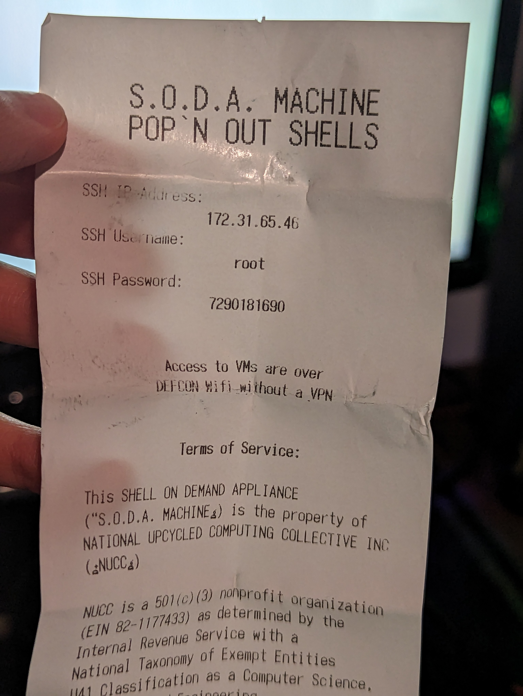
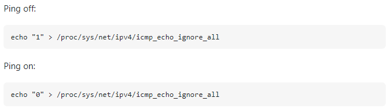

# Advertising your Minecraft server with pings: How to return custom ICMP Echo Reply messages

Saturday, August 19, 2023

---

So I was at [DEF CON](https://defcon.org/) last week (world's largest and most fun hacker cons, I highly recommend going), and I saw many wonderful and fun things there. One of those was what is called the [S.O.D.A Machine](https://forum.defcon.org/node/246908), which is basically a soda machine that outputs credentials to a virtual machine rather than an actual soda. Naturally, I had to try it.

I heard about it from a tweet shortly before the con and thought it would be fun to try. It was the 2nd thing I was most excited for (the first being [getting an LED installed in my hand](https://twitter.com/koppanyh/status/1690060881353408515)) and made sure my friends knew that we were going to be doing this.

So we went to the chillout area on Thursday only to find out the machine was out of order. The next day we went and again found it out of order. However it started working later that day, so I sacrificed a dollar to receive the legendary VM credentials. Score.

 \
<sub>Top of the receipt, it was kind of long, it said TL;DR: DFIU after all the legal parts.</sub>

At this point I had no idea what to do with it. I didn't think that far ahead. So I fired up my little disposable 2010s netbook running Manjaro on a [spinning rust drive](https://www.urbandictionary.com/define.php?term=Spinning%20Rust) and SSHed in just to see that it worked, and it did. A minimal Debian environment running as root.

The next day on Saturday, one of my other friends was curious about DEF CON and ~~stole~~ borrowed the badge of the one that was with me the prior day (it's ok, she slept the first half of the day and did not miss the badge). We wanted to do some actual hacking, so we got the idea to run a Minecraft server on it.

That's all well and good, but not if no one knows about it. So we thought about how to advertise the server without being so obvious, and somehow we arrived at the possibility of returning a custom message in the ICMP reply when someone pings it so that they could have instructions for how to connect. Then we could just spread little strips of paper (ripped out of my tiny yellow legal pad) that said something like "Ping me: 172.31.65.46" and log each ping to see if it's actually working. Bonus points for logging IPs on the Minecraft server to see how many of those pings lead to our advertisement scheme working. Minecraft for real hackers 😎

With the plan laid out, my friend took the netbook and started to try to set up the Minecraft server while I tried to do some badge hacking on the [DEFCON Furs](https://2023.dcfurs.com/) badge (that was infinitely cooler than the plastic square that was the standard DEF CON badge). We spent maybe around an hour on the con floor doing this before it was time to go do something else. The MC server installation ran into too many dependency errors and didn't get finished. I decided to stay down on the con floor while my friends went to go shopping (I think).

I would spend the rest of the con thinking about this project and I even took some Wireshark traces and did a bit of research on the ICMP protocol. I also tried to see how one would even go about returning custom messages (and hoping there was a simple program I could just run to do this, but I couldn't find one (not that I really looked)). I found out that you could [disable the ping response](https://unix.stackexchange.com/questions/412446/how-to-disable-ping-response-icmp-echo-in-linux-all-the-time) which was part of the OS itself. You could then basically do a packet capture to see when you received an ICMP echo request packet and craft your own ICMP echo reply packet as a response. I didn't get as far as actually implementing it, but at least I had a vague high-level idea of what to do.

 \
<sub>This is the magic sauce to turn off the OS's ping replies</sub>

Not to be deterred, I still really wanted to do it, since it would definitely be a learning experience. So I spent a few hours for the next few days after the con to chisel away at this project. At this point I didn't have my trusty S.O.D.A. virtual machine, so I just used one of my cloud servers as the dev environment for this, SSHing in and writing all the code through Vim with tmux, as I would've on the S.O.D.A.

I found out that you could [write a packet sniffer in python using only the standard libraries](https://www.uv.mx/personal/angelperez/files/2018/10/sniffers_texto.pdf) (that's how I roll), so I wrote a test program to just output the ICMP requests so that I could match them up with the Wireshark traces and try to decode them. I wrote an IP packet header decoder class ([as per the RFC](https://datatracker.ietf.org/doc/html/rfc791#section-3.1)) to detect when there was an ICMP packet (which apparently is all you get with `socket.socket(socket.AF_INET, socket.SOCK_RAW, socket.IPPROTO_ICMP)`). Then I wrote an ICMP decoder class (also [as per the RFC](https://datatracker.ietf.org/doc/html/rfc792)) specifically for detecting when that ICMP packet was an echo request.

With that, I then modified the classes to work in reverse, so that I could just manually change whatever fields I wanted and then call `.toBytes()` to get them to turn into a byte list to be sent out. This way the ICMP byte list could be inserted into the IP header's data field, then the header turned into a byte list that is a whole response. I even had to learn how to [calculate the checksums](https://en.wikipedia.org/wiki/Internet_checksum#Calculating_the_IPv4_header_checksum) used by these packets, which turns out to be pretty simple.

The basic approach to generating the reply for an ICMP echo request is to swap the source and destination IP addresses in the IP header, set the ICMP's type to 0 (8 indicates a request, 0 is a reply), and recalculate the checksums on both ICMP and IP header. In this case, also updating the data field to be something other than whatever the reply had in it.

So that's what I did, and... it didn't work. After a few hours of combing over everything and comparing real ICMP echo replies to the ones I'm generating and checking that I was generating the checksums correctly, I finally figured it out. Turns out Python's socket `.sendto()` already encapsulates whatever you give it with an IP header before sending it out. So my full IP packet was being wrapped in an IP packet. I had to use tcpdump on the server to capture these malformed packets for analysis in Wireshark on my laptop, and then it was immediately obvious that this was the problem.

So I just removed the part where I put my ICMP packet into an IP header and sent the raw ICMP packet back to the sender and it worked. Yay for doing things the hard way.

Once that was done, I was finally getting those sweet sweet ICMP echo replies coming back to me. Since the con was over, I just encoded the message "if you can read this then you're a haxxor B)" as a test payload. Some ping applications didn't like my custom reply (looking at you macOS). Turns out this is because the spec requires that the data payload in the reply is exactly the same as the request. Oh well, the spec can go fly a kite, we have secret data to return!

 \
<sub>Only took a few days to get to this point</sub>

Now that I've got this working, maybe my friend and I will revisit the idea at DEF CON 32 next year. Who knows, maybe it'll even work.

For those interested, here's the full code in all its full ~~jank~~ glory (it's exactly as it's running on my cloud server, I didn't expect to write this blog post so I didn't make it pretty):
```python 
# https://www.uv.mx/personal/angelperez/files/2018/10/sniffers_texto.pdf
# https://unix.stackexchange.com/questions/412446/how-to-disable-ping-response-icmp-echo-in-linux-all-the-time

import socket

s = socket.socket(socket.AF_INET, socket.SOCK_RAW, socket.IPPROTO_ICMP)

def hexify(v):
	h = hex(v)[2:]
	if len(h) == 1:
		return "0" + h
	return h

def calculateChecksum(data):
	index = 0
	checksum = 0
	while index < len(data):
		high = data[index] << 8
		index += 1
		low = 0 if index >= len(data) else data[index]
		index += 1
		checksum += high | low
	while checksum > 0xFFFF:
		carry = checksum >> 16
		checksum &= 0xFFFF
		checksum += carry
	return checksum ^ 0xFFFF

class Stream:
	def __init__(self, data):
		self.data = data
		self.index = 0
	def readU8(self):
		val = self.data[self.index]
		self.index += 1
		return val
	def readU16(self):
		val = self.readU8() << 8
		return val | self.readU8()
	def readU32(self):
		val = self.readU16() << 16
		return val | self.readU16()

class IPHeader:
	def __init__(self, stream):
		self.version = stream.readU8()
		self.header_len = (self.version & 0x0F) * 4
		self.version >>= 4
		self.tos = stream.readU8()
		self.total_len = stream.readU16()
		self.identification = stream.readU16()
		self.frag_flags = stream.readU16()
		self.fragment = self.frag_flags & 0x1FFF
		self.frag_flags >>= 13
		self.ttl = stream.readU8()
		self.protocol = stream.readU8()
		self.checksum = stream.readU16()
		self.source_addr = stream.readU32()
		self.dest_addr = stream.readU32()
		self.options = []
		for _ in range(self.header_len - 20):
			self.options.append(stream.readU8())
		self.data = None
	def isICMP(self):
		return self.protocol == 1
	def toBytes(self):
		total_len = 20 + len(self.options) + len(self.data)
		data = [
			self.version << 4 | self.header_len >> 2,
			self.tos,
			total_len >> 8, total_len & 0xFF, #self.total_len >> 8, self.total_len & 0xFF,
			self.identification >> 8, self.identification & 0xFF,
			self.frag_flags << 5 | self.fragment >> 8, self.fragment & 0xFF,
			64, #self.ttl,
			self.protocol,
			0, 0, #self.checksum >> 8, self.checksum & 0xFF,
			self.source_addr >> 24, (self.source_addr & 0xFF0000) >> 16, (self.source_addr & 0xFF00) >> 8, self.source_addr & 0xFF,
			self.dest_addr >> 24, (self.dest_addr & 0xFF0000) >> 16, (self.dest_addr & 0xFF00) >> 8, self.dest_addr & 0xFF,
		]
		data.extend(self.options)
		data.extend(self.data)
		self.checksum = calculateChecksum(data)
		data[10] = self.checksum >> 8
		data[11] = self.checksum & 0xFF
		return data
	def __repr__(self):
		return f'IPHeader(ver:{self.version}, hln:{self.header_len}, tos:{self.tos}, tln:{self.total_len}, idn:{self.identification}, fgs:{self.frag_flags}, frg:{self.fragment}, ttl:{self.ttl}, ptc:{self.protocol}, chk:{self.checksum}, src:{self.source_addr}, dst:{self.dest_addr}, opt:{self.options}, dat:{self.data})'

class ICMPEcho:
	def __init__(self, stream):
		self.type = stream.readU8()
		self.code = stream.readU8()
		self.checksum = stream.readU16()
		self.identifier = None
		self.seq_num = None
		self.data = None
	def isEchoReq(self):
		return self.type == 8
	def finalize(self, stream, header):
		self.identifier = stream.readU16()
		self.seq_num = stream.readU16()
		self.data = []
		for _ in range(header.total_len - header.header_len - 8):
			self.data.append(stream.readU8())
	def toBytes(self):
		data = [
			self.type,
			self.code,
			0, 0, #self.checksum >> 8, self.checksum & 0xFF,
			self.identifier >> 8, self.identifier & 0xFF,
			self.seq_num >> 8, self.seq_num & 0xFF
		]
		data.extend(self.data)
		self.checksum = calculateChecksum(data)
		data[2] = self.checksum >> 8
		data[3] = self.checksum & 0xFF
		return data
	def __repr__(self):
		return f'ICMPHeader(typ:{self.type}, cod:{self.code}, chk:{self.checksum}, idn:{self.identifier}, seq:{self.seq_num}, dat:{self.data})'

message = list(b'If you can read this, then you\'re a hacker B)')
message = list(b'1F Y0U C4N r34D 7H15 7H3N Y0Ur3 4 H4XX0r B)')

while True:
	p, i = s.recvfrom(65565)
	print()
	print(' '.join([hexify(x) for x in p]))
	stream = Stream(p)
	header = IPHeader(stream)
	print(header)
	if not header.isICMP():
		continue
	icmp = ICMPEcho(stream)
	if not icmp.isEchoReq():
		continue
	icmp.finalize(stream, header)
	print(icmp)
	icmp.type = 0
	icmp.data = message
	p = bytes(icmp.toBytes())
	#source_addr = header.source_addr
	#header.source_addr = header.dest_addr
	#header.dest_addr = source_addr
	#header.data = icmp.toBytes()
	##break
	#p = bytes(header.toBytes())
	#print(' '.join([hexify(x) for x in p]))
	#stream = Stream(p)
	#header = IPHeader(stream)
	#print(header)
	#icmp = ICMPEcho(stream)
	#icmp.finalize(stream, header)
	#print(icmp)
	print(s.sendto(p, i))
```

<sub>Posted by [koppanyh](https://github.com/koppanyh) on 2023/08/19 at 10:09 PM PDT</sub>
