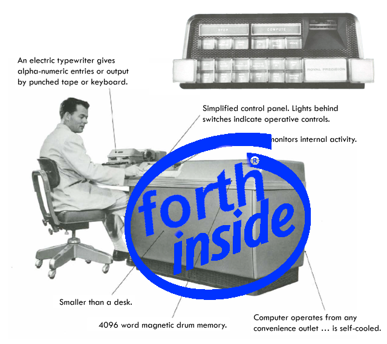
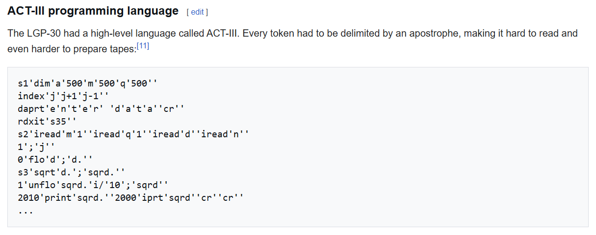

# Forth on your LGP-30? More likely than you think.

Wednesday, February 4, 2026

---



Back at [VCF SoCal](https://www.vcfsocal.com/) 2025, I was talking to one of the exhibitors, Larry Cameron, about the Forth programming language and how elegant and simple it is. [Forth](https://en.wikipedia.org/wiki/Forth_(programming_language)) is a beautiful stack-based programming language that was introduced to the world in the early '70s. Because of that, you know it's going to be resource-efficient and simple.

One of the things that Larry was exhibiting happened to be a little hardware replica of the [LGP-30](https://en.wikipedia.org/wiki/LGP-30), a vacuum tube computer from the mid '50s that used a magnetic drum for memory.

After I had mentioned that Forth was so simple that it could probably be ported to anything that had more than a few bytes of memory, he wondered if it would be possible to port it onto the LGP-30. My response was similar to "sure! does it have a C compiler?", to which he laughed because this machine probably started to become obsolete a decade before C was even a thing.

Ok, fine, I'd just write it in assembly. After all, How Hard Could It Be™? Especially after I wrote [Tetris for the Voja4](https://blog.kh-labs.org/2022/11/tertis-supercon-production) by hand on paper.

Turns out it was a little more work than I thought.

## Forth

For those of you who don't know Forth, I highly recommend reading [this Hackaday article](https://hackaday.com/2017/01/27/forth-the-hackers-language/) about it. It's truly a beautiful language and I encourage everyone to learn about it.

I've written many Forth-like interpreters so I expected that making a reference implementation to port to the LGP would've been fairly quick. But I also decided that I wanted it to be at least a little standards-compliant so that anyone could play around with it.

After that first day of VCF, I went home with full intentions of getting the most minimal Forth interpreter written in C so that I could present Larry with a floppy disk containing a ~~really crappy~~ working Forth, mainly for fun. Unfortuantely, I got home rather late and was tired, so I didn't get that far.

I ended up spending the next 8-ish months writing this Forth implementation, which was definitely because of scope creep. I wanted it to be standards-compliant, but I also figured I might as well make it a personal reference implementation that was flexible enough to be embedded into any of my future projects with minimal changes needed to make it run on most modern systems. Then of course, also implement the file extension for it so that I could also bootstrap any missing words using words defined in a file.

The portability was centered around the concept of a BIOS, which was a single header file that implemented things that had to interact with the system it was running on (such as terminal I/O and file handling). This way I could have a standard interface that the rest of the Forth implementation could use without modification, only needing to change the BIOS as needed to support new platforms.

I also ended up learning a lot about Forth itself in the process, such as how the `DOES>` word works and how to implement it. Or how conditional and looping words are implemented and use the data stack at compile time to hold any data needed for compilation.

I finally ended up with a reasonably functional Forth at version 0.3, which is still a far cry from what I would consider "production ready", but should be Good Enough™ to start making functional systems from it such as the LGP-30 port.

The repo can be found here: https://github.com/koppanyh/kopForth

## LGP-30

This machine is a bit of a funky one, as you can imagine. It was designed to be small and cheap, with one of the selling points being that it was only around the size of a desk! And it was so low power that the room it was in didn't even need air conditioning! The future was now!

Being such a small machine meant that it was also relatively simple, and so it only had 16 opcodes to work with.

It also used magnetic drum memory, meaning that addressing was done in a track-sector format with 64 tracks and 64 sectors per track for a whole 4096 words. And each word was 31-ish bits (with each memory word being 31 bits but the accumulator (acc) being 32 bits).

The reason for that was that the smallest bit in a word was used to reset the magnetic heads or something (I'm not entirely sure how it worked exactly) and it was called the "spacer bit". But the acc register was stored in a physically different layout on the drum and so could support the full 32 bits.

Each word was layed out in this format when it was used as an opcode:
```
sign          opcode  track  sector   spacer
|             |       |      |        |
0 00000000000 0000 00 000000 000000 0 0
```
But would have this layout when used as general data:
```
sign                             spacer
|                                |
0 000000000000000000000000000000 0
  |
  data
```

Math also didn't work how it usually does these days. Instead of plain old integer math, it had a weird floating point thing going on. There's an add and subtract instruction which works more or less how you'd expect, but then divide and multiply upper and multiply lower get a little funky. And you even had to be careful not to somehow trigger an arithmetic overflow, since that would halt the machine!

So for example, multiplying 3 with 5 would require you to write those numbers out in a way where they'd represent how many places the binary decimal point had to be shifted to make it less than 1, and then multiply the numbers together and adding the shift values together (basically like doing math in scientific notation):
```
3 = 0b0011.0
shift 2 left: 0b00.110
becomes 3q2

5 = 0b0101.0
shift 3 left: 0b0.1010
becomes 5q3

5x3 = 15 = 0b1111
2+3 = 5
so 15q5

acc: 0 01111 0000000000000000000000000 0
      |_____|
       15q5
```

To make things worse, even text input is weird! The LGP can input from either tape or the funky teletype keyboard thing it had. The inputs can be 4 bit or 6 bit. But when it's reading input, it'll shift and add to the acc until you send it a `'` character. So clearing the acc and entering `abc'` in 6 bit mode would leave you with this value which then has to be shifted left at least one bit to not lose the lowest bit when saved to memory:
```
a: 0b111001
b: 0b000101
c: 0b110101

acc: 0 000000000000011100100010111010 1
                                      ^
      shift 1 left to avoid losing this
```

This is the reason why ACT-III and ALGOL 30 programs look so strange, because each "token" is just how many characters you can fit into a single word and parsing is so much easier if it's only 1 word long.

 \
<sub>[Look upon it and dispair!](https://en.wikipedia.org/wiki/LGP-30#ACT-III_programming_language)</sub>

## Assembler

The LGP-30 does come with a program loader known as P104 (an abbreviation of Program 10.4) that can read in paper tapes and load them into memory and jump to specified addresses.

I figured this would be a good format to work with (as opposed to peeking and poking raw memory values with the Simh debugger) since I'd be able to package the Forth up in a nice little tape file for distribution. I already had an example of that through the [blackjack program](https://github.com/koppanyh/LGP-30/blob/main/programs/bkjck.tx) from [The Story Of Mel](https://en.wikipedia.org/wiki/The_Story_of_Mel).

But there was one problem: there was basically no documentation for this tape format...

Eventually I was able to find the German documentation for the P104 tape loader and made an [English translation](https://github.com/koppanyh/LGP-30/blob/main/docs/P104/translation.md) of it (which might even be the only one on the internet). I used a local multimodal LLM (one of the extremely few uses of AI in one of my retrocomputing projects) to transcribe scans of the German docs, for which I manually fixed any transcription errors, and then sent the transcription to Gemini for translation (which also needed a bit of manual correction and formatting). Combined with a bit of reverse engineering of other tapes I had found, I was able to confirm that the translated document was correct.

Then I started writing sample programs directly as tape files, but that became very tedious very fast. I couldn't include comments, and the addresses had to be hardcoded which made modifications really annoying since I'd have to update a bunch of addresses.

I decided to write some type of assembler to get modern conveniences, like labels and macros and all the other things we take for granted in the modern world. For the sake of time, it ended up being more of a Python library used to write programs that would end up returning lists of instructions as tape output. The nice part about this is that I didn't have to worry about a lexer or a tokenizer or a macro system since Python itself already parsed everything for me, allowing me to focus specifically on the assembler logic. Here's an example of that that looks like: https://github.com/koppanyh/LGP-30/blob/main/assembler/demo.py

I rewrote it 3 times afterwards to finally arrive at version 4 of the assembler. Then I made minor changes to it as I went along with the porting effort and ran into things that would be nice to have. The joys of writing your own assembler is that it can work however you want :)

## Porting Forth

Once I had an understanding of the LGP-30 under the hood and had a working assembler, it was time to start actually porting kopForth over.

I actually started with the stack, the most essential part of Forth. Writing this would basically lay the foundation for the style and structure of the rest of the ported code. Afterwards came the BIOS since that was supposed to be the part that really defined the unique parts of a system (not that this was the case here, since this machine is so bespoke to begin with). I also had to add a utility library of macros to provide things like pseudo-opcodes and helper macros and other stuff to extend the capabilities of the assembler. I had this policy that the assembler should be kept as simple as possible and anything that can be defined outside shouldn't be defind inside, which is why this utility library was made.

It took quite a while to implement all the things in the BIOS, since a lot of it is dealing with terminal I/O (which is already a hassle due to how characters are handled), but I also had to write *everything* from scratch since there were no pre-made subroutines for printing an integer.

At this point it was just a matter of chugging away and doing a somewhat 1-to-1 port of kopForth, including the different headers and all that. I did have to deviate in a few places because this wasn't C and because such a unique machine required a few unique implementations for things. I did learn more about Forth in this process as well, since some things had to be very different for this port, which caused me to have to go back to the fundamentals of Forth and see things in a different way.

After nearly a month of chugging away during any spare time I could find while on the bus to/from work or after work before needing to go to sleep, I finally had a working Forth system. It was very imperfect, and not particularly fast (although I did include a few optimizations which helped by an order or two of magnitude), but it worked. It was good enough to say I had done it and show it off to the world.

Most importantly, it was ready *before* VCF, so I would just have to worry about writing this post and then coming up with the material and stuff for the little exhibit of the project.

The source code for the port and even a pre-built tape can be found here: https://github.com/koppanyh/LGP-30/tree/main/kopForth \
(I was even nice enough to include instructions!)

## Conclusion

So there you have it, Forth on the LGP-30. This might be the oldest system that Forth has been written for (if not, please let me know, but I wouldn't mind holding that record).

It required me to understand Forth at some of the lowest levels, which caused me to learn even more about this language than I thought I would. It required me to find the hidden documentation for this machine and translate it for the world. It required me to learn how to work with such a weird machine and think in different ways. I'd say this was a good project. Maybe not the most useful, but still a good project that I am proud to have done.

And in the porting effort, I also discovered changes that I want to make to kopForth, so it actually fed back into the prior project in a useful way.

I do have some changes that I'd like to make, if I consider continuing the LGP Forth project. The main ones being a more efficient stack implementation for faster runtime, and a much more efficient inner interpreter. I actually already have pseudo-assembly for the inner interpreter changes, and it was that which taught me just how efficiently a Forth inner interpreter can be written if you are freed from the confines of a structured language like C.

Who knows, maybe some day Forth will actually become a viable option for a language to run on the LGP-30. One can dream.

<sub>Posted by [koppanyh](https://github.com/koppanyh) on 2026/02/04 at 10:47 PM PST</sub>

<sub>[Permalink](https://blog.kh-labs.org/2026/02/forth-on-your-lgp-30)</sub>
